# AI 执行图

## 1. 定位

本文不是非系统执行清单，而是 Orchestrator 可读取、可拆解、可派发给 AI Agent 的终态执行图。每个节点都应被转换为 WorkItem，并由对应 AI role session 自动完成。

## 2. 执行 DAG

```mermaid
flowchart TD
    A["SPEC-A: 固化终态机器规格"] --> B["CORE-A: 控制平面对象和迁移"]
    A --> C["PROTO-A: Agent Runtime 协议实现"]
    A --> D["MCP-A: MCP Proxy 和工具 schema"]
    A --> S["SKILL-A: agency-agents-zh 角色 skill registry"]
    A --> T["MODEL-A: 常用模型 provider 和能力画像"]
    A --> P["PLACE-A: session placement policy"]
    B --> E["ROOM-A: Room Broker 和事件可靠性"]
    B --> F["COMMAND-A: Command Bus、Outbox、DLQ"]
    B --> G["LEASE-A: 项目级资源锁"]
    C --> H["AGENT-A: join、heartbeat、probe、本地 outbox"]
    D --> I["TOOL-A: 系统 MCP tools"]
    E --> J["SESSION-A: session_start、checkpoint、finding"]
    F --> J
    G --> J
    H --> J
    I --> J
    S --> K
    T --> K
    P --> K
    J --> K["ORCH-A: Orchestrator 调度循环"]
    K --> L["VERIFY-A: Reviewer/QA/Security 自动复验"]
    L --> M["INTEGRATE-A: ChangeSet、IntegrationBatch、release manifest"]
    M --> N["CLOSE-A: close barrier 自动关闭"]
```



## 3. WorkItem 模板

每个 DAG 节点必须生成如下 task contract：

```text
WORK_ID=<dag-node-id>
ROLE_ID=<ai-role>
ROLE_SKILL_REF=<agent-role-skill-ref>
INPUT_SCHEMA=<schema-ref>
INPUT_LOCATORS=<docs/spec/code locators>
INPUT_DIGESTS=<sha256 digests>
WRITE_SCOPE=<repo/path/db/tool scope>
MODEL_SELECTION_DECISION_REF=<model-selection-decision-ref>
SESSION_PLACEMENT_DECISION_REF=<session-placement-decision-ref>
DEPENDENCIES=<dag upstream nodes>
OUTPUT=<code|migration|schema|checkpoint|artifact|finding|commitRef|pushRef|evidenceRefs|verificationRefs>
STOP_OR_RETURN=<done|blocked|stale_state|permission_required|spec_drift>
VERIFY_BY=<independent reviewer or qa role>
```

## 4. 角色绑定

| 节点前缀 | 默认 AI role | 输出 |
| --- | --- | --- |
| SPEC | Protocol Architect Agent | schema、manifest、state machine |
| CORE | Control Plane Backend Agent | migrations、services、tests |
| PROTO | Agent Runtime Agent | runtime protocol、local db、recovery |
| MCP | MCP Security Agent | proxy、grant、tool schemas |
| ROOM | Realtime Agent | room、cursor、ack、wake |
| COMMAND | Workflow Agent | commands、attempt、DLQ、effects |
| LEASE | Resource Control Agent | lease、fencing、conflict handling |
| AGENT | Runtime Integration Agent | join、heartbeat、probe、session runner |
| TOOL | MCP Tooling Agent | orchestration/resource/model/evidence/permission tools |
| SKILL | Skill Registry Agent | agency-agents-zh source sync, role skill parse, overlay validation |
| MODEL | Model Registry Agent | provider probe, capability profile, model selection policy |
| PLACE | Scheduler Agent | new WorkSession vs subagent placement decision |
| SESSION | WorkSession Agent | task execution and checkpoint |
| ORCH | Orchestrator Agent | scheduling loop and close barrier |
| VERIFY | QA/Reviewer/Security Agent | independent verification evidence |
| INTEGRATE | Release Agent | change set, batch CI, release manifest |
| CLOSE | Orchestrator Agent | final state transition |

## 5. 自动提交和推送策略

AI Agent 执行节点时必须按 `spec/git-automation-policy.schema.json` 和 `spec/git-command.schema.json` 自动提交和推送，不把 Git 操作交给入口会话或非系统执行路径。

规则：

1. 一个 DAG 节点完成且通过本节点验证后提交。
2. 提交信息包含 node id、role、stateVersion 和影响面。
3. 推送前检查 `git status --short`，并用 `changedPathPolicy.mustMatchWriteScope=true` 校验所有 changed path。
4. 推送后必须记录 `pushRef`、远端 SHA 和 command effect evidence。
5. 推送失败进入 command retry；连续失败进入 DLQ 并触发 Monitor Agent。
6. 合并到主线必须走 IntegrationBatch，不由实现 Agent 自行宣布发布完成。

## 6. 机器验收信号

| 信号 | 来源 |
| --- | --- |
| schema_valid | validator output |
| migration_applied | db migration ledger |
| api_contract_passed | contract tests |
| room_replay_passed | room cursor replay test |
| command_idempotent | duplicate command test |
| lease_exclusive | concurrent lease test |
| agent_recovered | disconnect/reconnect test |
| mcp_proxy_enforced | unauthorized tool call test |
| permission_routed | permission request simulation |
| checkpoint_registered | checkpoint and artifact metadata |
| independent_review_passed | Reviewer Agent evidence |
| close_barrier_satisfied | Orchestrator state check |

## 7. 不允许的完成报告

Agent 不能使用以下内容作为完成：

1. “已设计，后续实现”。
2. “需要非系统执行路径确认后继续”。
3. “理论上可以”。
4. “未运行测试但应该没问题”。
5. “等待非系统路径处理”。
6. “本地通过但没有 evidence”。
7. “已修复但没有独立复验”。

允许的完成必须包含：

```text
state transition
commitRef
pushRef
evidenceRefs
verificationRefs
remaining blockers if any
next machine-actionable work ids
```
