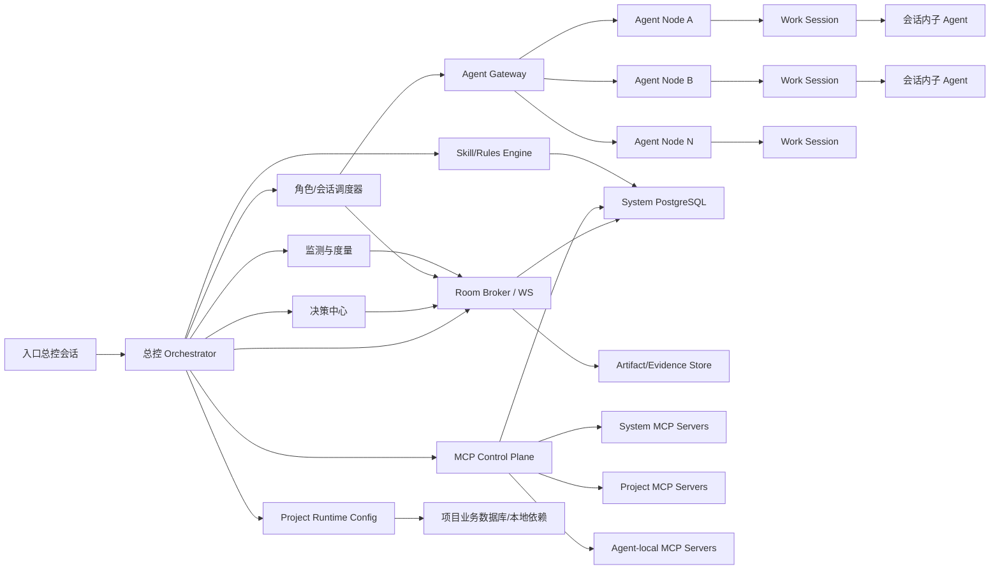
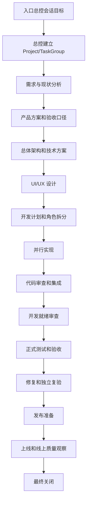

# 多 Agent 多会话项目全生命周期协作系统设计

## 0. 文档导航和机器执行入口

本文是系统终态蓝图。该系统面向 AI 模型、AI Agent 和程序执行器，不面向非系统执行路径。入口总控会话接收目标、边界和不可编程的外部能力信号；目标进入系统后的拆解、调度、执行、复验、提交、推送、发布准备、规则沉淀和关闭判断都必须由 Orchestrator、Decision Center、Scheduler、Agent Runtime、MCP Proxy、Policy Engine 和角色化 AI Agent 自动完成。

当前仓库把终态设计拆为以下机器执行入口：

| 文档 | 定位 |
| --- | --- |
| [终态自动执行范围](terminal-autonomous-execution-scope.md) | 定义全系统必须由 AI Agent 自动执行的终态能力边界 |
| [核心控制平面规格](core-control-plane-spec.md) | 固化终态数据库核心表、HTTP API、MCP tools、事件模型和事务边界 |
| [Agent Runtime 协议](agent-runtime-protocol.md) | 定义 Agent 自动加入、初始化、心跳、session、artifact、权限阻断和断线恢复 |
| [机器可执行制品说明](machine-executable-artifacts.md) | 说明 `spec/` 下 manifest、schema、state machine 和 event contract 的用途 |
| [AI 执行图](autonomous-execution-graph.md) | 定义由 AI Agent 自动执行的 DAG、角色绑定、验收信号和自动提交推送策略 |

实现代码、运行时 validator、MCP schema 和 contract tests 时，以 `spec/` 下机器可解析文件为执行优先级最高的项目内契约；自然语言文档只解释设计意图。

## 1. 设计目标

本系统目标是把一个项目从最初需求、方案、产品设计、UI 设计、前后端开发、测试、发布、线上质量验收到维护期的新功能、功能修改和 bug 修复，统一纳入一个由总控启动和调度的多 Agent、多会话、多子 Agent 协作系统。

系统必须满足：

1. 入口总控会话只接收目标、边界和不可编程的外部能力信号；系统不得把入口总控会话设计成项目执行者。
2. 总控负责识别项目、任务组、角色缺口、执行容量、依赖、冲突、进度和关闭条件。
3. 角色不是最小执行维度，最小执行维度是 `work session`。一个角色可以由多个 Agent 或多个会话并行承担。
4. 一个 Agent 可能是公共网络上的不同主机地址。系统必须提供统一实时协作、状态同步和唤醒机制。
5. 一个项目可以有多个任务组。每个任务组拥有独立协作房间、状态机、规则版本、证据和关闭屏障。
6. 系统数据库与业务项目数据库严格分离。项目自己的数据库按项目配置，优先支持本地 PostgreSQL，也允许 Agent 侧本地库做增量镜像。
7. 系统内置初始 skill/rules，并能在实际运行中把稳定问题、协作流程、角色要求、业务规则沉淀为版本化规则，约束后继会话。
8. 开发期、验证期和终态线上质量要求要分层，不能把代码完成、开发 safeguard、静态审计或单接口通过误报成生产完成。
9. 系统本身要同时提供 MCP Server 能力，并能管理项目级、Agent 级 MCP Server，使加入系统的 Agent 可被总控完整调度、观测、授权、唤醒、停用和回收。

## 2. 从 MGP 当前协作吸收的关键经验

当前 MGP 多任务执行中已经暴露出一些必须固化到系统层的经验：

1. 阶段完成不能等于会话结束。需要独立的 `goalExecutionStatus`，把开发状态、验证状态和会话是否继续执行分开。
2. 等待依赖时不能高频空轮询。无有效 delta 时应进入事件驱动等待，由总控在真实 checkpoint、P0、contract digest、阶段门或写入面变化时唤醒。
3. 公共文件可以作为过渡机制，但长期会带来写锁、分片、提交和上下文成本。最终应由 Room Broker 承担实时消息、成员状态、ACK、lease 和游标。
4. 同工作树并行容易被误报为隔离 worktree。系统必须用机器可判定的 write scope 和 lease 表达真实写入边界。
5. 普通问题应批量交付。P0、安全、资金、数据破坏、证据污染、主线偏移、共享写入冲突和契约变化才立即打断。
6. 实现者不能自证自己修复完成。修复会话和独立复验会话必须分离。
7. 开发期 safeguard 需要收缩。syntax、lint、unit、contract、DI scan 可以在子批执行，完整多实例、性能、E2E、长稳和现实一致性应集中到正式验证阶段。
8. 控制消息应使用稳定任务契约加短 delta，避免重复粘贴背景。新子 Agent 默认不复制完整上下文，只传 locator、scope、输入、输出和停止条件。
9. 规则要有生命周期。旧路径、旧契约、旧数据链路不能永久兼容。能删除的同批删除，暂不能删除的进入 owner 的版本化生命周期登记。
10. 临时测试插桩允许存在，但必须有 manifest、owner、runId、清理条件和固定 marker，不能进入普通提交，也不能作为生产等价完成证据。
11. 旧项目规则、旧源码、review 结果和工具输出只能作为来源材料；是否吸收为本系统规则必须经过 `RuleSourceResolution`，不能把历史材料直接变成 active rule。
12. 并行执行必须有 `ExecutionTopology`：runner、隔离、owned/forbidden paths、resource scope、branch result bundle、父级串行合并和最终集成验证都要可判定；不满足门禁时降级为串行。
13. 派生任务不能由 worker 或 review 直接创建为全局 WorkItem；它们只能提交 `DerivedTaskRequest`，由 Orchestrator 强化 action basis、分类 insertion mode 后排入 DAG。
14. 多 issue、多风险、多文件面或关闭前互审必须有 `ReviewPlan`、batch、coverage matrix 和 closure gate；单个 review report 不能默认覆盖全局。
15. 外部或旁路 AI review 结果只具 advisory 属性。进入系统前必须经 `ReviewBundle` 脱敏、digest、provider grant、本地核验和采纳分类。
16. WorkSession final、handoff、父级集成和 TaskGroup close 都必须先计算 `CompletionReadinessCheck`，不能只靠聊天计划或 Agent 自报完成。
17. 总控、调度和监测角色必须使用 `RoleDriftGuard` 锁定 objective boundary、role mission、task contract、ruleset digest 和 allowed action scope；元控制角色跑偏时要立即暂停下游副作用并由父级纠偏。
18. 系统运行中重复问题只收集为 RuntimeIssuePattern/SystemUpgradeCandidate 和外部维护证据包；真正系统升级由独立系统外维护完成，再通过后台管理或入口总控会话导入版本化结果。

这些经验不是 MGP 特例，应作为系统默认机制。但 MGP 的项目路径、工具名、业务规则、历史兼容要求、旧规则文件和非系统执行指令不能被整体搬入本系统；只能抽取通用协作机制，并经 `RuleSourceResolution` 分类为 generic 后进入 active rule 或 schema。

## 3. 总体架构



核心模块：

| 模块 | 职责 |
| --- | --- |
| Orchestrator 总控 | 入口总控会话、目标拆解、任务组创建、角色分配、阶段推进、冲突裁决、关闭屏障 |
| Decision Center | 方案、架构、产品、技术、质量和取舍决策，输出 ADR/Decision Record |
| Role/Session Scheduler | 根据角色需求、Agent 能力、资源和写入面创建或复用会话 |
| Agent Gateway | 管理公网 Agent 节点注册、鉴权、心跳、能力、任务下发和结果回传 |
| Room Broker | 每个项目和任务组的实时协作房间，提供 WS、消息游标、ACK、订阅、唤醒 |
| MCP Control Plane | 注册、发布、代理、授权和审计系统级、项目级、Agent 本地 MCP Server 和 tools |
| Rules Engine | 加载系统规则、项目规则、角色规则、任务规则和动态沉淀规则 |
| Work Lease Manager | 管理文件、目录、仓库、DB、环境、容器、外部资源等互斥写入或运行资源 |
| Monitor | 监测会话状态、进度、阻塞、长时间无产出、消息风暴、token 成本和质量门 |
| Artifact Store | 存放方案、设计稿、PRD、ADR、证据、截图、日志摘要、测试报告和最终交付 |
| Project Runtime Config | 项目级数据库、Git、环境、CI、部署、密钥引用和运行拓扑配置 |

### 3.1 系统功能域

系统本身至少要实现以下功能域，不能只依赖外部会话约定：

| 功能域 | 必需能力 |
| --- | --- |
| 项目管理 | Project、TaskGroup、Task、WorkItem、阶段、目标、关闭条件 |
| 总控调度 | 角色拆分、会话创建/复用/回收、依赖图、优先级、补位 |
| 模型调度 | Agent 模型能力识别、任务组模型策略、固定模型、自动择优、推理级别和并行度控制 |
| Workflow/Command | command bus、attempt、timeout、retry、cancel、compensation、DLQ |
| Contract 治理 | API/DB/消息/配置/UI 契约版本、消费者绑定、兼容性检查、级联失效 |
| 集成合并 | ChangeSet、merge queue、IntegrationBatch、batch CI、冲突 owner、release manifest |
| Agent 管理 | 节点注册、初始化、资源画像、额度画像、心跳、控制通道、故障恢复 |
| Agent 沙箱 | 专用用户、工作目录、进程组/容器、网络限制、命令白名单、清理 |
| 权限/弹窗治理 | 权限预检、弹窗检测、权限阻断回传、总控/决策中心裁决、重试或改派 |
| 实时协作 | Room、WS、消息序列、ACK、cursor、delta、checkpoint、wake |
| MCP 能力 | 系统 MCP Server、项目 MCP Server、Agent-local MCP、tool grant、schema、审计 |
| Git 管理 | 项目 Git 账号池、仓库配置、凭据绑定、checkout/worktree、commit/push/PR |
| 规则治理 | ruleset、skill、动态规则沉淀、互审、版本、通知 |
| 资源和锁 | 文件/目录/仓库/DB/topic/Docker/MCP/tool/provider lease |
| 权限和密钥 | OIDC、service identity、policy engine、secret ref、租约、轮换、撤销 |
| 审批审计 | ApprovalRequest、quorum、超时、append-only audit、hash chain、读写审计 |
| 证据管理 | artifact、run、test report、screenshot、trace、review report、digest |
| 执行环境 | environment allocation、snapshot、seed、feature flag、镜像、配置和污染清理 |
| 知识索引 | rules、文档、代码、checkpoint、evidence、decision 的定位和检索 |
| 质量门禁 | 开发门、集成门、E2E、性能、安全、多实例、发布、线上质量 |
| 监控度量 | 会话状态、资源、额度、MCP 健康、Git 状态、成本、返工率、主动告警 |
| 安全审计 | RBAC、secret ref、审批、操作审计、公网节点零信任 |
| 发布运维 | CI/CD、部署计划、回滚、监控、告警、线上观察 |

## 4. 核心对象模型

系统不以 Agent 为最小维度，而以 `work session` 为最小可调度工作单元。

```text
Project
  TaskGroup
    Task
      WorkItem
        WorkSession
          SessionSubAgent

AgentNode
  AgentRuntime
    WorkSession

Room
  Message
  Event
  Decision
  Checkpoint
  Evidence

Contract
  ContractVersion
  ConsumerBinding

ChangeSet
  IntegrationBatch
  MergeQueueItem

ExecutionEnvironment
  EnvironmentSnapshot

PermissionRequest
ApprovalRequest
AuditLog
AgentTrustEvent
```

对象定义：

| 对象 | 定义 |
| --- | --- |
| Project | 一个独立业务项目，有自己的代码仓、业务数据库、环境和规则覆盖 |
| TaskGroup | 围绕一个目标建立的协作单元，例如新项目建设、core-init、某次版本发布 |
| Task | TaskGroup 下的一级任务，例如后端主开发、客户端修复、独立审计 |
| WorkItem | 可分配的具体工作包，有输入、输出、写入面、依赖和验收条件 |
| AgentNode | 公网或内网的一台可执行 Agent 主机 |
| WorkSession | 某 Agent 或总控启动的一次角色化会话，是系统调度、状态、消息和回收的基本单位 |
| SessionSubAgent | WorkSession 内部为了局部搜索、审查、实现或验证启动的子 Agent，不直接参与全局调度 |
| Room | 项目、任务组或专项的实时协作通道，不等同于纯聊天，承载结构化事件和控制 |
| Checkpoint | 某工作包可恢复状态，必须能说明事实、提交、证据、剩余项和恢复入口 |
| Decision | 全局或局部决策记录，具有 owner、依据、适用范围和失效条件 |
| Evidence | 测试、截图、日志、命令、审查、监控或运行结果的证据引用 |
| Contract | API、DB schema、消息 topic、配置、设计 token 或跨端协议等机器可判定契约 |
| ChangeSet | 一个或多个 work 产生的代码、文档、配置和 migration 变更集合 |
| IntegrationBatch | 多个 ChangeSet 进入主线前的合并、rebase、批量 CI 和冲突处理单元 |
| ExecutionEnvironment | 某次测试、构建、E2E 或发布验证所使用的可复现运行环境 |
| PermissionRequest | Agent 执行中遇到的 OS、浏览器、MCP、OAuth、Git、DB、网络或本地工具权限阻断 |
| ApprovalRequest | 高风险动作、范围变更、生产动作或权限发放的可调度审批对象 |
| AuditLog | 控制面、读写工具、secret、artifact、Git、MCP 和审批的防篡改审计记录 |
| AgentTrustEvent | Agent 运行期可信度变化、违规、降级、隔离和基于可信证据的自动解封记录 |

## 5. 总控职责

总控是入口总控会话和权威调度器，不是项目经理岗位。它不亲自完成所有实现，而是把目标转换为机器可执行任务契约并调度角色化 AI Agent。主要职责是：

1. 接收入口总控会话目标并建立项目或任务组。
2. 判断任务类型：新项目、功能修改、新功能、bug 修复、重构、性能、线上故障、规则治理、验收发布。
3. 读取规则、项目现状、历史 checkpoint、开放事项和真实运行状态。
4. 拆分阶段、任务、角色、工作包和写入面。
5. 自动创建、复用、暂停、回收或补位会话。
6. 维护唯一权威游标：当前阶段、当前波次、开放事项、阻断、依赖和关闭条件。
7. 监控所有角色和会话的状态、进度、输出质量、资源占用和成本。
8. 处理冲突、角色缺口、主线偏移、重复工作、证据污染和阶段误判。
9. 推动规则沉淀，把稳定问题转化为可执行规则。
10. 在全部关闭条件满足后统一关闭任务组，而不是让单个会话自行结束全局任务。

总控可以内置决策中心，也可以自动创建独立决策会话。建议实现为：

| 决策类型 | 默认 owner |
| --- | --- |
| 产品范围、优先级、里程碑 | 总控 + Product Analyst Agent |
| 架构、契约、数据库、接口 | 决策中心 + 对应领域 Agent owner |
| UI/交互终态 | Product/UX/UI Agent owner，重大变更由总控裁决 |
| 测试、验收和发布门 | QA/Release Agent + 独立 Reviewer Agent |
| 跨角色冲突 | 总控最终裁决 |
| 规则变更 | Rule Steward Agent + 独立 Reviewer Agent + 总控确认 |

## 6. 角色体系

系统内置角色不是固定人数，而是角色模板。Owner、Manager、Reviewer 等名称都表示可实例化的 Agent role，不表示非系统岗位。总控根据项目和任务组自动实例化为一个或多个 WorkSession。

基础角色：

| 角色 | 主要职责 |
| --- | --- |
| Project Controller | 项目级总控、进度、资源、风险、关闭屏障 |
| Product Analyst | 需求澄清、业务流程、PRD、验收口径 |
| Solution Architect | 总体方案、系统边界、数据流、技术选型、ADR |
| UX Designer | 用户流程、信息架构、交互状态、可用性 |
| UI Designer | 视觉规范、组件、页面状态、响应式和交互细节 |
| Backend Owner | API、DB、领域模型、任务、消息、性能和安全 |
| Frontend Owner | 页面、状态、接口消费、错误处理、可访问性和构建 |
| Mobile Owner | iOS/Android/H5 等移动端能力 |
| QA Owner | 测试策略、用例、自动化、E2E、证据矩阵 |
| Security Owner | 鉴权、权限、密钥、数据安全、依赖风险 |
| DevOps/Release Owner | CI/CD、环境、部署、回滚、监控、告警 |
| Reviewer | 独立只读审查，不能参与同批实现 |
| Rule Steward | 规则版本、沉淀、冲突和镜像同步 |
| Monitor | 持续读取状态、检查无进展、异常、锁、资源和成本 |

角色实例化原则：

1. 一个角色可以有多个 session，例如 Backend Owner 可拆为 API、DB、worker、integration。
2. 一个 AgentNode 可承载多个 session，但要受 CPU、内存、上下文、工具和写入面限制。
3. 持续多轮、长耗时、有状态、拥有写入面、需要角色 owner 或可能跨文件/跨服务修改的 work，Scheduler 默认创建新 WorkSession。
4. 子 Agent 只用于短小、封闭、单轮、只读或局部扫描任务；子 Agent 只为当前 session 服务，不直接拥有全局任务。
5. 单个总控 session 存在子 Agent 容量上限；接近上限时，Scheduler 必须优先创建新 WorkSession，而不是继续堆叠子 Agent。
6. 独立 reviewer 必须是未参与对应实现批次的 session。
7. 同职责连续工作优先复用同一个 session，避免上下文和状态割裂。
8. 新 session 默认使用最小上下文：规则 locator、任务 locator、输入数据、写入面、输出格式和停止条件。

### 6.1 外部角色 skill 源

系统默认从 `https://github.com/DlenoDing/agency-agents-zh.git` 加载预定义角色 skill。该源以 `main` 的 pinned commit、`AGENT-LIST.md`、`CATALOG.md` 和各分类目录下的 markdown role file 为默认角色库。Skill Registry 必须解析 frontmatter、正文、路径、分类、能力描述和 digest，生成 `AgentRoleSkill` 对象。

默认优先级：

```text
task_group_overlay
-> project_overlay
-> agency-agents-zh upstream_default
```

规则：

1. 上游仓库内容是默认事实来源，不直接改写。
2. 项目级或任务组级特殊要求只能生成 `RoleSkillOverlay`，并绑定 overlay digest、DecisionRecord、影响面、stateVersion 和 audit。
3. overlay 只能覆盖角色指令、能力权重、工具要求、模型需求和输出格式，不能覆盖系统不变量、权限边界、lease、审计或关闭条件。
4. 上游 commit、catalog、role file 和 overlay 都必须有 digest；digest 变化触发 affected WorkSession rebind。
5. 供应链、安全或格式异常时，Skill Registry 把 source 或 skill 标记为 `quarantined`，Scheduler 不再选择它。
6. 上游仓库变化不得在运行期自动替换 pinned commit；只能生成 `SystemUpgradeCandidate` 和系统外升级证据包。
7. Scheduler 选择 Agent 时同时选择 `AgentRoleSkill` 和模型，写入 `ModelSelectionDecision`。

## 7. 项目全生命周期流程

### 7.1 新项目从 0 到 1



阶段说明：

下表是 TaskGroup 的运行期 lifecycle state，不是交付分期、路线图或渐进版本计划。每个状态都必须有机器可判定输入、输出和关闭条件。

| 阶段 | 关键输出 | 关闭条件 |
| --- | --- | --- |
| Intake | 项目目标、范围、约束、成功标准 | 目标契约、边界 digest 和成功标准足以启动自动分析 |
| Discovery | 现状、用户、竞品、业务流程、风险 | 缺口和假设已列出 |
| Product Design | PRD、用户故事、状态流、验收口径 | 每个核心场景有输入、输出、异常和验收 |
| Solution Design | 架构图、数据流、接口、DB、运行拓扑、ADR | 关键技术决策有依据和 owner |
| UI/UX | 页面流、组件状态、视觉稿、响应式要求 | 核心页面和状态完整 |
| Implementation Plan | WBS、角色、写入面、依赖、测试计划 | 无依赖 work 可并行，共享资源有 owner |
| Development | 前后端、任务、迁移、配置、文档 | 所有 required work 达 `code_complete` |
| Global Dev Review | 跨模块契约、旧路径、性能结构、安全审查 | 无开发阻断 |
| Verification | 单测、集成、E2E、性能、安全、多实例、现实数据 | 每个 target 有证据和结论 |
| Repair/Reverify | 根因修复、批量复验、回归 | 修复者与复验者分离 |
| Release | 发布计划、回滚、监控、告警、数据迁移 | 发布风险可控且审批完成 |
| Online Quality | 线上 SLO、错误率、性能、业务指标观察 | 达到终态质量门 |
| Close | 关闭候选、剩余风险、文档、规则沉淀 | 总控统一关闭 |

### 7.2 维护、新功能和 bug 修复

维护任务使用同一机制，但按风险缩小分母。

流程：

1. 总控接收变更请求。
2. 分类：bug、功能修改、新功能、线上事故、数据修复、性能优化、规则治理。
3. 做影响面分析：代码、DB、接口、缓存、队列、前端、移动端、运维、文档、数据。
4. 定级：L0/L1/L2/L3。
5. 决定是否新建 TaskGroup。跨项目、跨端、生产主路径或多角色协作必须新建。
6. 指派 owner 和 reviewer。
7. 先定位根因，不直接改。
8. 最小修复或完整功能开发。
9. 执行风险匹配的测试。
10. 独立复验和关闭。
11. 若发现可固化规则，交 Rule Steward 沉淀。

状态上，维护任务也必须有 `goalExecutionStatus`，避免因为“修了一个点”就退出，而遗漏同根因影响面。

## 8. 状态机设计

### 8.1 任务组状态

| 字段 | 值 |
| --- | --- |
| `deliveryStage` | `intake`、`discovery`、`product_design`、`solution_design`、`ui_design`、`development`、`global_development_review`、`verification`、`repair`、`reverification`、`integration`、`release`、`online_quality`、`closed`、`aborted` |
| `goalExecutionStatus` | `active`、`active_waiting_dependency`、`active_waiting_approval`、`active_paused_by_freeze`、`active_supporting_group`、`closed` |
| `riskLevel` | `L0`、`L1`、`L2`、`L3` |
| `controlStateVersion` | 每次 owner、阶段、scope、digest、依赖、规则或关闭条件变化递增 |

`blocked` 不作为任务组业务状态，只能作为某个工具或会话的传输状态。任务组是否仍需继续，以 `goalExecutionStatus` 为准。

### 8.2 WorkItem 状态

```text
draft -> ready -> assigned -> in_progress -> checkpoint_submitted
      -> code_complete -> review_requested -> review_passed
      -> verification_ready -> verified -> close_candidate -> closed
```

异常状态：

| 状态 | 含义 |
| --- | --- |
| `blocked_dependency` | 依赖未满足，有明确 wakeTrigger |
| `blocked_resource` | 锁、环境、配额或主机不可用 |
| `needs_decision` | 需要 Decision Center、Policy Engine 或 Orchestrator 裁决 |
| `stale_state` | 本地看到的 stateVersion 过期，必须重新绑定 |
| `invalidated` | 上游输入、契约、环境、规则或依赖 digest 变化，已完成结论失效 |
| `reverify_required` | 代码或结论仍可能有效，但必须由独立 reviewer/QA 重新验证 |
| `reopened` | 已关闭 work 因线上问题、范围变化或契约失效被总控重开 |
| `superseded` | 被新 work 替代，必须有替代关系 |
| `aborted` | 由总控终止，必须记录原因 |

### 8.3 WorkSession 状态

| 状态 | 含义 |
| --- | --- |
| `starting` | 正在创建会话或分配 Agent |
| `active` | 正在执行 |
| `waiting_room_event` | 事件驱动等待 |
| `waiting_dependency` | 等待特定依赖 |
| `permission_required` | 缺少权限、授权、OAuth、系统弹窗或本地工具许可，已暂停副作用并回传总控 |
| `needs_decision` | 需要 Decision Center、Policy Engine 或 Orchestrator 裁决 |
| `stale_state` | 本地 stateVersion 过期，必须重新绑定任务契约 |
| `completed_objective` | 精确 objective 完成，可回收 |
| `recycled` | 已回收 |
| `failed` | 异常退出，需要恢复 |
| `aborted` | 已由总控取消或中止 |

长期主会话不会因为局部 objective 完成直接回收，除非所属任务组已经 closed 或总控明确改派。

### 8.4 Finding、Bug 和 Incident 状态

维护、新功能和 bug 修复必须把 finding 当成一等流程对象，不能把 reviewer 评论直接等同为已修复。

```text
reported -> triaged -> accepted|rejected|duplicate
         -> root_cause_confirmed -> impact_scanned
         -> fix_planned -> fixed -> reverify_requested
         -> reverified -> closed
```

规则：

1. `duplicate` 必须绑定 canonical finding 或 `root_cause_group`。
2. `root_cause_confirmed` 前不得直接进入大范围修复，除非是生产止血并记录临时措施。
3. `impact_scanned` 必须说明受影响代码、数据、接口、环境、文档、规则和线上用户面。
4. `fixed` 只能由修复 owner 提交，`reverified` 必须由独立 reviewer 或 QA 提交。
5. 同根因 finding 多次出现时，Rule Steward 必须评估是否沉淀规则。

### 8.5 IntegrationBatch 状态

并行 WorkSession 的局部通过不能直接等于主线通过。所有需要进入主线的 ChangeSet 必须经过集成批次：

```text
work_branch_verified -> queued_for_integration -> rebased
-> batch_ci_running -> batch_verified -> merge_ready -> merged
```

异常状态：

| 状态 | 含义 |
| --- | --- |
| `merge_conflict` | 与其它 ChangeSet 或主线冲突，需要 conflict owner |
| `batch_ci_failed` | 批量集成 CI 失败，需要拆分或回退到具体 ChangeSet |
| `contract_mismatch` | 契约版本或消费者绑定不一致 |
| `rolled_back` | 已合入变更被回滚，必须绑定 rollback evidence |

### 8.6 ApprovalRequest 状态

审批必须是可调度对象，不是聊天中的一句同意。

```text
requested -> pending_review -> approved|rejected|expired|cancelled
```

每个审批必须绑定 `actionType`、`exactDiffOrCommandRef`、`riskLevel`、`requiredApprovers`、`quorum`、`expiresAt`、`onTimeout`、`scopeChangeRef` 和 `auditRef`。生产部署、不可逆迁移、密钥轮换、批量 tool/secret grant、跨项目策略修改和关闭重大任务组必须走审批状态机。

### 8.7 PermissionRequest 状态

Agent 遇到权限弹窗、授权缺失、OAuth 登录、系统许可、网络 allowlist、MCP grant 或 Git/DB 凭据不足时，必须转成 PermissionRequest。

```text
observed -> classified -> routed_to_controller
         -> approved|rejected|reassigned|grant_issued|external_capability_required
         -> external_capability_available -> preauthorized_capability_bound -> grant_issued
         -> retrying -> resolved|aborted
```

规则：

1. Agent 不得在未知权限弹窗上自行点击同意。
2. 可由系统授权的权限，例如 MCP grant、Git credential、secret lease、网络 allowlist，可以由总控、PolicyDecision、ApprovalRequest 和 audit 后下发。
3. OS 安全弹窗、UAC、macOS TCC、浏览器账号登录、第三方 OAuth consent 等不能假设可自动批准；系统只能检测、截图/摘要、回传为 `external_capability_required`，然后使用已登记的外部能力信号绑定受限 capability、改派、降级或中止。
4. AI quorum 不能把外部能力边界包装成普通 grant；外部能力必须有 capability registry、external actor evidence、policy decision、audit、有效期和 revocation。
5. PermissionRequest 必须包含 `promptType`、进程/窗口、请求资源、风险级别、截图或日志 artifact、当前阻断 work、可选处理方案和安全重试点。
6. 超时未处理时，总控必须选择改派到已授权 Agent、降低任务范围或中止 work，不能让 session 长期空等。

## 9. Room Broker 和实时协作机制

Room 不是普通聊天室，而是结构化协作和控制通道。每个 Project 有一个 project room，每个 TaskGroup 有一个 group room，必要时每个专项或批次有 sub-room。

### 9.1 消息投递

采用 WebSocket + 持久消息日志：

1. 所有消息有单调递增 `sequence`。
2. session 使用 cursor 拉取未读消息。
3. 消息 at-least-once 投递，通过 `idempotencyKey` 去重。
4. 每个 recipient 需要 ACK 到 sequence。
5. 普通进度不唤醒空闲 session，只有订阅的 delta、P0、决策、阶段门、review_request 或直接 @member 才触发唤醒。
6. active session 默认自己通过 `room_wait` 获取消息。idle session 由 Wake Bridge 唤醒。

### 9.2 消息模型

```json
{
  "schemaVersion": "control-event/v1",
  "protocolVersion": "control-plane/v1",
  "schemaDigest": "sha256:aaaaaaaaaaaaaaaaaaaaaaaaaaaaaaaaaaaaaaaaaaaaaaaaaaaaaaaaaaaaaaaa",
  "eventId": "evt_...",
  "projectId": "prj_...",
  "taskGroupId": "tg_...",
  "roomId": "room_...",
  "sequence": 12034,
  "type": "checkpoint_submitted",
  "priority": "normal",
  "sender": {
    "sessionId": "sess_...",
    "roleId": "backend-owner"
  },
  "actor": {
    "actorType": "session",
    "actorId": "sess_..."
  },
  "subject": {
    "type": "checkpoint",
    "id": "chk_..."
  },
  "recipients": ["role:qa-owner", "session:sess_..."],
  "correlationId": "corr_...",
  "idempotencyKey": "task-checkpoint-...",
  "stateVersion": 12,
  "payloadSchemaRef": "spec/checkpoint.schema.json",
  "payloadRef": "db:checkpoints/chk_...",
  "payloadDigest": "sha256:bbbbbbbbbbbbbbbbbbbbbbbbbbbbbbbbbbbbbbbbbbbbbbbbbbbbbbbbbbbbbbbb",
  "guardEvidenceRefs": ["artifact_..."],
  "createdAt": "2026-07-23T05:00:00Z",
  "expiresAt": "2026-07-24T05:00:00Z"
}
```

### 9.3 事件类型

| 类型 | 用途 |
| --- | --- |
| `command` | 总控下发任务或纠偏 |
| `delta` | 短增量，引用 checkpoint 或 issue ID |
| `checkpoint` | 可恢复阶段成果 |
| `finding` | 审查或测试发现 |
| `decision` | 已裁决事项 |
| `decision_request` | 需要决策中心裁决 |
| `review_request` | 独立互审请求 |
| `review_result` | 互审结果 |
| `handoff` | owner 交接 |
| `blocker` | 阻断 |
| `progress` | 低优先级进度 |
| `wake` | 唤醒信号 |
| `close_candidate` | 关闭候选 |

### 9.4 防消息风暴

1. 每个 session 每轮最多消费 N 条普通消息，P0 例外。
2. 普通进度合并为摘要，不逐条广播。
3. 相同根因 finding 批量进入 issue queue。
4. room 消息 TTL 和 `hopCount` 防止 Agent 互相自动回复。
5. Monitor 发现同类消息高频重复时，自动要求事件驱动等待。

## 10. 公网 Agent 节点接入

AgentNode 可能位于公网不同主机。接入方式：

1. 每个 AgentNode 启动本地 `agent-runtime`。
2. runtime 通过 TLS 连接 Agent Gateway。
3. Gateway 先执行 Agent 初始化，不直接分配业务任务。
4. 节点注册能力：模型、工具、语言、平台、可访问项目、Docker、数据库、本地路径、并发容量、MCP server 和可代理 tools。
5. 心跳上报：CPU、内存、磁盘、GPU、网络、任务数、session 状态、工具可用性、MCP 健康和配额画像。
6. Scheduler 根据资源状态、可用额度、项目权限、写入面 lease 和任务风险分配 work session，传入最小任务契约。
7. session 通过 Room Broker 通信，通过 Artifact Store 上传证据，通过 MCP Control Plane 使用被授权工具。

### 10.1 Agent 初始化流程

Agent 首次加入或重连后必须完成初始化握手：

```text
agent-runtime start
-> node_register
-> protocol_negotiation
-> runtime_integrity_attestation
-> node_attest
-> capability_scan
-> model_discovery
-> resource_snapshot
-> quota_snapshot
-> mcp_discovery
-> project_access_probe
-> control_channel_open
-> scheduler_admission
```

初始化采集：

| 类别 | 需要采集的信息 |
| --- | --- |
| 主机身份 | `nodeId`、hostname、公网/内网地址、运行用户、系统版本、时区、证书指纹 |
| 运行完整性 | runtime 版本、二进制 hash、安装 manifest、镜像 digest、配置 digest、沙箱模式、时间同步 |
| 资源 | CPU 核数和负载、内存总量/可用量、磁盘空间和 IO、GPU、网络延迟、容器运行能力 |
| 工具 | shell、Git、Docker、Node、Python、浏览器、移动端构建工具、测试工具、可用 MCP tools |
| 模型能力 | 可用 provider、模型 ID、模型别名、推理档位、上下文窗口、输入/输出模态、速度等级、质量等级、成本等级 |
| 额度/限速 | 账号/组织、剩余额度或限速窗口、模型级并发限制、最近失败/429 |
| 项目访问 | 可访问仓库、路径、分支、项目 DB、secret scope、artifact 上传权限 |
| 控制能力 | 创建/停止 session、取消任务、读取状态、执行命令、上传证据、刷新规则、MCP proxy |

初始化结果写入系统库并生成 `agent_profile_digest`。Scheduler 之后只基于最新画像分配任务；画像过期、心跳中断或资源低于阈值时，节点只能接收只读轻任务或进入隔离。

准入基线：

1. `protocolVersion` 必须在 Control Plane 支持范围内，低于 `minRuntimeVersion` 的 Agent 只能进入升级或只读状态。
2. runtime、安装 manifest、容器镜像和配置 digest 必须通过签名或 hash 校验。
3. 证书未过期、未吊销，join token 已消费且不能复用。
4. 沙箱、运行用户、工作目录、项目 allowlist、时间同步和主机基本安全项必须满足项目策略。
5. 任一 P0 准入项失败时，`scheduler_admission=quarantine|read_only`，不得分配写入、secret、Git push、部署或高风险 MCP 工具。

### 10.2 资源画像和任务匹配

任务分配不是只看 Agent 是否在线，还要看资源是否适合：

| 任务类型 | 资源要求示例 |
| --- | --- |
| 只读文档/代码审查 | 低 CPU、低内存、无需 Docker |
| 普通前端修复 | Node/npm 可用、内存足够、浏览器可选 |
| Android 构建 | Android SDK/JDK/Gradle、较高内存和磁盘 |
| 后端集成 | Docker、本地 DB、项目声明的依赖服务、端口和网络可用 |
| E2E/浏览器 | 浏览器/Playwright、可访问 local 环境、截图能力 |
| 性能/长稳 | 独占运行窗口、稳定网络、足够 CPU/内存、低负载 |

Scheduler 应把 CPU、内存、磁盘、现有 session 数、容器占用、任务期限和风险级别纳入评分。资源不足时不要硬派重任务，也不要把性能或长稳验收派给负载不稳定节点。

### 10.3 额度画像和预算策略

Agent 初始化时必须采集可用额度和限速信息，用于判断是否适合接任务：

| 字段 | 说明 |
| --- | --- |
| `quotaProvider` | 模型或工具额度来源 |
| `remainingTokens/credits` | 可见剩余额度，未知时标记 `unknown` |
| `rateLimitWindow` | 当前窗口限制和重置时间 |
| `recentThrottle` | 最近是否出现 429、quota exceeded 或工具限流 |
| `estimatedTaskCostClass` | `small/medium/large/xlarge/unknown` |
| `quotaConfidence` | 额度估算可信度 |

策略：

1. 额度用于任务分配和风险提示，不作为默认硬性执行上限。
2. 实际任务执行默认不设置过小预算上限，避免估算不准导致中途失败，使前序分析、修改和测试成本作废。
3. 当额度明显不足以完成任务时，Scheduler 不派发大任务，改派短 reviewer、只读扫描、轻量文档，或生成 `capacity_unavailable` 事件并重新规划可执行 work。
4. 长任务必须定期 checkpoint，降低额度耗尽或主机故障造成的损失。
5. 对外部付费 API、生产资源和用户明确指定预算的任务，仍必须遵守对应硬上限和审批门。

### 10.4 模型能力识别和模型策略

Agent 初始化时必须识别自己支持的模型，而不是让总控硬编码假设。

模型能力至少记录：

| 字段 | 说明 |
| --- | --- |
| `provider` | 模型提供方或本地 runtime |
| `modelId` | 实际可调用模型 ID |
| `modelAlias` | 系统内别名，例如 `deep_reasoning`、`balanced`、`fast_fix` |
| `reasoningLevels` | 支持的推理档位，例如 `low/medium/high/max` 或 provider 等价档位 |
| `contextWindow` | 可用上下文能力 |
| `inputModes` | text、image、audio、file、tool 等 |
| `outputModes` | text、code、json、image 等 |
| `toolUseSupport` | 是否支持工具调用、MCP、函数调用或代码执行 |
| `speedClass` | `fast/normal/slow` |
| `qualityClass` | `simple/balanced/deep` |
| `costClass` | `low/normal/high/unknown` |
| `quotaState` | 可用、低额度、限速、未知 |
| `lastProbeAt` | 最近一次探测时间 |

任务组可以设置模型策略：

| 策略 | 含义 |
| --- | --- |
| `fixed_model` | 全任务组或指定角色固定使用某个模型 |
| `fixed_tier` | 固定使用某类模型，例如高推理或快速模型，由系统在可用模型中映射 |
| `auto_best` | 自动选择最适合任务质量和风险的模型 |
| `auto_fast` | 对低风险、重复性、局部修复优先选择快速模型 |
| `cost_aware` | 在满足质量门的前提下倾向低成本模型 |
| `policy_required` | 关键阶段必须由任务组模型策略、Decision Center 或 Orchestrator 显式指定模型 |

默认模型选择规则：

1. 架构设计、跨项目契约、P0、安全、资金、数据破坏、最终关闭和独立复验优先使用 `deep` 或高推理档。
2. 局部代码搜索、简单文档整理、格式修复、单文件小 bug、重复 source scan 可用 `fast`。
3. 普通开发用 `balanced`，遇到自相矛盾、复杂根因或反复失败时升级到 `deep`。
4. Reviewer 不一定使用最高成本模型，但必须满足独立性和足够推理能力；重大 reviewer 使用高推理档。
5. 固定模型策略优先于自动策略，但如果目标 Agent 不支持该模型，必须返回 `MODEL_UNAVAILABLE`，由总控重派或调整策略。
6. 模型额度低只影响 admission 和调度优先级，不在已派发任务中默认设置不可靠的小预算硬限制。

### 10.4.1 Session placement 策略

Scheduler 派发前必须同时输出 `ModelSelectionDecision` 和 `SessionPlacementDecision`。模型决定回答“哪个模型和角色 skill 最适合”，placement 决定回答“创建新 WorkSession 还是使用当前 session 内短任务子 Agent”。

默认 placement：

| 信号 | placement |
| --- | --- |
| `expected_multi_turn`、`long_running`、`stateful_context` | `new_session` |
| `role_owner_required`、`independent_work_owner`、`write_scope_owner` | `new_session` |
| `cross_file_or_cross_service_change`、`external_capability_flow`、`git_or_release_side_effect` | `new_session` |
| `single_turn`、`read_only_scan`、`localized_search`、`format_only_change` | `subagent` |
| `no_persistent_state` 且 `no_global_task_ownership` | `subagent` |
| `subagent_limit_approaching` 或 `controller_context_pressure` | `new_session` |

约束：

1. 新会话是持续执行单元，必须拥有 `session_start`、room cursor、checkpoint、outputContract、model selection 和 audit。
2. 子 Agent 是短任务执行器，不拥有 WorkItem 状态，不持久占用全局角色，不独立关闭任务。
3. 子 Agent 结果必须回填到父 session checkpoint 或 evidence，不直接修改权威状态。
4. 如果短任务升级为多轮、产生写入需求或需要持续 owner，Scheduler 必须把它提升为新 WorkSession。
5. 该策略由 `spec/session-placement-policy.schema.json` 和 manifest 的 `sessionPlacementPolicy` 校验。

### 10.5 Agent 控制面

Agent 加入系统后必须接受总控所需的控制能力，但控制必须可审计、可授权、可回滚：

| 控制能力 | 说明 |
| --- | --- |
| `session_start` | 按任务契约启动 work session |
| `session_steer` | P0、阶段门或纠偏时向 active session 注入控制 delta |
| `session_pause` | 暂停新副作用，保留现场和后台已授权任务状态 |
| `session_cancel` | 取消未开始或可安全中止的任务 |
| `session_recover` | 从 checkpoint、room cursor 和本地 outbox 恢复 |
| `tool_enable/disable` | 按项目和角色启用或禁用 MCP/tool capability |
| `resource_probe` | 刷新 CPU、内存、磁盘、Docker、DB、网络和额度 |
| `model_probe` | 刷新可用模型、推理档位、上下文、速度、质量和额度 |
| `permission_probe` | 检查 OS、浏览器、MCP、Git、DB、网络、OAuth、Keychain/credential helper 权限状态 |
| `permission_report` | 把弹窗、授权缺失或许可阻断转成 PermissionRequest 回传总控 |
| `artifact_collect` | 收集日志摘要、测试报告、截图和 evidence manifest |
| `git_prepare` | 按项目 Git 配置 checkout/fetch/worktree/branch |

总控不能绕过项目权限直接执行任意高风险动作。所有控制命令必须绑定 `projectId/taskGroupId/sessionId/runId/idempotencyKey`，并进入审计日志。

### 10.6 Agent 自动加入脚本和最小 bootstrap

Agent 加入系统必须做到“总控生成 join token、受信执行环境运行 bootstrap、系统自动初始化”。不要要求 Agent Runtime 之外的配置动作填写仓库、MCP、数据库、规则路径和资源参数。

总控侧生成一次性加入令牌：

```bash
agentctl join-token create \
  --project <project_id> \
  --node-name <expected_node_name> \
  --roles backend,frontend,reviewer,qa \
  --ttl 30m \
  --max-uses 1
```

给 Agent 主机执行的最小 bootstrap 模板。受信开发环境可以使用管道方式，生产环境必须使用后面的校验版：

```bash
curl -fsSL https://control.example.com/install-agent.sh | sudo bash -s -- \
  --server https://control.example.com \
  --join-token <one_time_join_token> \
  --node-name "$(hostname)" \
  --work-dir /opt/ai-agent
```

生产推荐的校验版保持单命令模板形态，但必须先校验再执行：

```bash
tmp="$(mktemp -d)" && cd "$tmp" && \
curl -fsSLO https://control.example.com/install-agent.sh && \
curl -fsSLO https://control.example.com/install-agent.sh.sha256 && \
shasum -a 256 -c install-agent.sh.sha256 && \
sudo bash install-agent.sh \
  --server https://control.example.com \
  --join-token <one_time_join_token> \
  --node-name "$(hostname)" \
  --work-dir /opt/ai-agent \
  --runtime-version <pinned_version> \
  --runtime-sha256 <expected_sha256>
```

交互式 token 写法只用于避免 token 留在 shell history，不替代生产校验版：

```bash
read -s AGENT_JOIN_TOKEN
curl -fsSL https://control.example.com/install-agent.sh | sudo AGENT_JOIN_TOKEN="$AGENT_JOIN_TOKEN" bash -s -- \
  --server https://control.example.com \
  --node-name "$(hostname)" \
  --work-dir /opt/ai-agent
```

容器化加入方式：

```bash
docker run -d --name ai-agent-runtime --restart unless-stopped \
  -e AGENT_JOIN_TOKEN="<one_time_join_token>" \
  -e AGENT_SERVER="https://control.example.com" \
  -e AGENT_NODE_NAME="$(hostname)" \
  -v /opt/ai-agent:/var/lib/ai-agent \
  ghcr.io/example/ai-agent-runtime@sha256:<pinned_digest>
```

默认容器模式不挂载 `/var/run/docker.sock`。确实需要构建容器或管理测试环境时，应使用受限 Docker proxy 或项目专用 rootless Docker，并把可操作 image、network、volume 和 compose profile 纳入 policy。

脚本必须自动完成：

1. 安装或更新 `agent-runtime`。
2. 创建专用运行用户、工作目录和本地 SQLite。
3. 校验安装脚本、runtime 包、容器镜像、manifest、配置模板的 SHA256 和签名。
4. 固定 runtime 版本或镜像 digest，不使用 `latest` 作为生产加入方式。
5. 连接 Agent Gateway 并完成 mTLS/JWT bootstrap。
6. 上报 CPU、内存、磁盘、GPU、网络、Docker 和工具链。
7. 识别支持的模型、推理档位、上下文能力、速度/质量/成本等级。
8. 采集模型/工具额度和近期 throttle 状态。
9. 发现本地 MCP server 和可代理 tools。
10. 拉取项目 runtime config、Git 仓库配置和授权的 secret refs。
11. 验证 Git 账号池权限，但不默认 clone 全部仓库。
12. 打开 Room/Control channel，返回 `nodeId`、`agent_profile_digest` 和 `scheduler_admission`。

加入成功后的标准回显：

```text
AGENT_JOINED
nodeId=agent_...
nodeName=...
agentProfileDigest=sha256:...
resourceClass=small|medium|large|xlarge
quotaClass=low|normal|high|unknown
models=<count>
modelAliases=deep_reasoning,balanced,fast_fix
mcpServers=<count>
gitProfiles=<count>
schedulerAdmission=read_only|limited|full
```

入口总控会话生成的 Agent Runtime bootstrap 指令：

```text
由受信执行环境执行下面的一条加入命令。目标主机只完成 Agent Runtime 入网，不在 Agent Runtime 之外 clone 仓库、配置 MCP、连接数据库或注入密钥。
命令完成后只上报 AGENT_JOINED 回显里的 nodeId、agentProfileDigest 和 schedulerAdmission。
```

鉴权建议：

| 场景 | 机制 |
| --- | --- |
| AgentNode 到 Gateway | mTLS 或短期 JWT + node certificate |
| Session 到 Room Broker | scoped token，绑定 project/taskGroup/session |
| 访问项目资源 | project-scoped secret reference，不把密钥写入消息 |
| 高风险动作 | policy、Decision Center、Security Agent、Release Agent 和 Orchestrator 的 approval gate |
| 审计 | 所有命令、消息、决策、证据写审计日志 |

公网通信必须默认不信任 AgentNode。本地路径、密钥、数据库和仓库权限都按项目 scope 授权。

### 10.7 Agent 信任评分、降级和隔离

AgentNode 入网准入不是一次性判断。系统必须持续记录 `agent_trust_events` 并维护 `agent_reliability_score`。

触发降级或隔离的事件：

1. 多次违反 write scope、lease、MCP grant 或 secret policy。
2. 提交证据与实际 artifact、commit、环境 snapshot 不一致。
3. 心跳异常后恢复但本地 outbox、cursor 或 checkout 与系统状态不一致。
4. runtime、MCP tool、模型能力、配置 digest 或证书状态发生未授权变化。
5. 同类任务返工率、失败率或 reviewer 驳回率显著高于项目基线。
6. 出现未授权网络出站、敏感路径读取、异常子进程或可疑依赖安装。

降级动作：

| 动作 | 说明 |
| --- | --- |
| `read_only` | 只允许只读扫描、文档阅读和低风险 reviewer |
| `extra_review_required` | 该 Agent 输出必须增加独立复验 |
| `revoke_grants` | 撤销 Git、MCP、secret 和部署 grant |
| `pause_side_effects` | 暂停所有写入型 command，等待总控裁决 |
| `quarantine` | 隔离节点，不再分配新任务，仅允许上传恢复证据 |
| `evidence_unblock` | 基于 runtime digest、日志、配置、outbox、checkout 和 artifact manifest 的可信证据解封 |

### 10.8 权限弹窗和阻断回传

真实运行中，Agent 会遇到几类权限问题，处理能力不同：

| 类型 | 能否自动处理 | 处理方式 |
| --- | --- | --- |
| 系统内权限 | 可以 | MCP grant、Git credential、secret lease、DB profile、网络 allowlist 由 Permission Gateway 申请，总控/策略/审批后下发 |
| 项目工具权限 | 部分可以 | 项目 MCP、CI、部署平台、设计工具、文档系统用 service account 或预授权 token；缺失时回传 `permission_required` |
| OAuth/账号登录 | 外部能力边界 | 使用预授权 service account、device code、OAuth URL 或已有浏览器登录状态；Agent 回传授权 locator、截图和影响面，不保管长期账号密码 |
| OS 安全弹窗 | 外部能力边界 | macOS TCC、Screen Recording、Accessibility、Windows UAC、Keychain、Linux sudo/polkit 必须预检、预授权、改派或中止 |
| 浏览器权限弹窗 | 低风险可策略化 | download、clipboard、camera、mic、location 等按项目策略；高风险默认回传总控 |
| 付费/额度确认 | 需要 policy/approval | 外部付费 API、模型额度升级、云资源创建必须走 ApprovalRequest 和自动审计 |

Agent Runtime 必须实现：

1. 启动前 `permission_probe`，把缺失权限写入 host permission profile。
2. 执行中捕获常见错误码、CLI 提示、浏览器弹窗、OAuth 回调等待、MCP `AUTH_REQUIRED/PERMISSION_DENIED`。
3. 生成 PermissionRequest：`projectId`、`taskGroupId`、`workId`、`sessionId`、`agentNodeId`、`promptType`、`requestedCapability`、`requestedResource`、`riskLevel`、`process/windowTitle`、`artifactRef`、`safeRetryPoint`、`suggestedActions`。
4. 立即暂停新的副作用，只保留可安全的日志、截图和状态上传。
5. 总控收到后可选择：发放系统权限、创建 ApprovalRequest、路由到预授权能力、改派到已授权 Agent、缩小 scope、跳过非必要步骤或中止 work。
6. 决策完成后通过 `permission_resolution` delta 唤醒 session，从 safe retry point 恢复。

边界：

1. Skill 可以定义权限预检清单、弹窗分类规则、回传格式和处理 SOP，但不能越过 OS 或第三方平台安全机制。
2. MCP 可以提供检测、申请、审批、授权和回传工具，但不能保证控制所有桌面弹窗。
3. 对安全敏感弹窗，系统默认不自动点击“允许”。允许自动处理的弹窗必须在项目规则中白名单化，并绑定低风险动作和审计。
4. 最优实践是把高频权限在 Agent 加入阶段预检并固化到 admission；运行时只处理少量真实变更或意外阻断。

## 11. 数据库设计

系统数据库推荐 PostgreSQL。业务项目数据库独立配置，不与系统数据库共库。

### 11.1 系统库核心表

| 表 | 核心字段 |
| --- | --- |
| `projects` | `id,name,status,default_ruleset_id,created_by,created_at` |
| `project_runtime_configs` | `project_id,git_repos,db_configs,env_profiles,secret_refs,egress_policies,deploy_targets` |
| `task_groups` | `id,project_id,name,delivery_stage,goal_execution_status,control_state_version,risk_level,owner_session_id` |
| `task_group_dependencies` | `id,project_id,source_task_group_id,target_task_group_id,dependency_type,status,reason` |
| `tasks` | `id,task_group_id,name,role_template,status,current_wave,owner_role_id` |
| `work_items` | `id,task_id,title,status,priority,write_scope,depends_on,acceptance,assigned_session_id` |
| `agent_nodes` | `id,host,public_endpoint,status,capabilities,last_heartbeat,capacity` |
| `agent_attestations` | `id,agent_node_id,protocol_version,runtime_version,binary_digest,manifest_digest,image_digest,sandbox_mode,certificate_status,admission_status,created_at` |
| `agent_trust_events` | `id,agent_node_id,event_type,severity,evidence_refs,policy_action,created_at` |
| `agent_reliability_scores` | `id,agent_node_id,scope,score,success_rate,rework_rate,review_reject_rate,last_updated_at` |
| `host_permission_profiles` | `id,agent_node_id,os_permissions,browser_permissions,credential_helpers,oauth_profiles,network_policy,last_probe_at` |
| `agent_model_capabilities` | `id,agent_node_id,provider,model_id,model_alias,reasoning_levels,context_window,input_modes,output_modes,speed_class,quality_class,cost_class,tool_use_support,available,last_probe_at` |
| `agent_resource_snapshots` | `id,agent_node_id,cpu,memory,disk,gpu,network,docker_status,load_score,captured_at` |
| `agent_quota_profiles` | `id,agent_node_id,provider,models,remaining,rate_limit_window,recent_throttle,confidence,captured_at` |
| `agent_control_channels` | `id,agent_node_id,protocol,status,last_sequence,last_ack,capabilities` |
| `task_group_model_policies` | `id,task_group_id,mode,fixed_model_id,fixed_tier,allowed_models,role_overrides,reasoning_policy,parallelism_policy,status` |
| `work_item_model_requirements` | `id,work_item_id,required_tier,min_context_window,required_input_modes,required_tools,preferred_speed,quality_floor` |
| `session_model_assignments` | `id,work_session_id,model_provider,model_id,model_alias,reasoning_level,selection_mode,selection_reason,quota_snapshot_id,created_at` |
| `model_selection_events` | `id,task_group_id,work_item_id,agent_node_id,selected_model,rejected_candidates,reason,created_at` |
| `work_sessions` | `id,agent_node_id,task_group_id,role_id,status,state_version,current_work_id,last_seen` |
| `change_sets` | `id,project_id,task_group_id,work_item_id,repository_id,branch,base_commit,head_commit,status,owner_session_id` |
| `integration_batches` | `id,project_id,task_group_id,name,baseline_commit,status,ci_run_ref,owner_session_id` |
| `merge_queue_items` | `id,integration_batch_id,change_set_id,order_index,status,conflict_owner_session_id,result_ref` |
| `contracts` | `id,project_id,type,name,owner_role,status,current_version_id` |
| `contract_versions` | `id,contract_id,version,digest,source_ref,compatibility,status,created_by` |
| `contract_consumers` | `id,contract_version_id,consumer_type,consumer_ref,required_compatibility,status` |
| `compatibility_checks` | `id,contract_version_id,target_ref,status,evidence_refs,checked_at` |
| `migration_plans` | `id,project_id,scope,type,contract_version_id,plan_ref,rollback_ref,risk_level,status` |
| `db_migration_ledgers` | `id,project_id,db_profile,migration_id,version,direction,status,dry_run_ref,applied_ref,verified_ref,rollback_ref` |
| `schema_versions` | `id,project_id,db_profile,schema_name,version,digest,captured_at` |
| `rooms` | `id,project_id,task_group_id,type,status` |
| `room_messages` | `id,room_id,sequence,type,priority,sender_session_id,body,idempotency_key,created_at` |
| `message_receipts` | `message_id,recipient,delivered_at,acked_at,cursor` |
| `mcp_servers` | `id,scope,owner_id,name,transport,endpoint,status,auth_profile,version,last_health_check` |
| `mcp_tools` | `id,mcp_server_id,name,schema_digest,capability_tags,risk_level,enabled` |
| `mcp_tool_grants` | `id,tool_id,project_id,role_id,session_id,param_policy,result_policy,expires_at` |
| `events` | `id,project_id,task_group_id,type,payload,created_at` |
| `decisions` | `id,task_group_id,title,status,owner,decision,scope,evidence_refs,supersedes` |
| `checkpoints` | `id,work_item_id,session_id,state_version,summary,commit_refs,evidence_refs,next_steps` |
| `findings` | `id,task_group_id,source_session_id,severity,status,root_cause_group,owner_role,evidence_refs` |
| `root_cause_groups` | `id,project_id,title,status,canonical_finding_id,impact_scan_ref,rule_candidate_id` |
| `finding_impacts` | `id,finding_id,target_type,target_ref,impact_level,scan_evidence_ref,status` |
| `leases` | `id,project_id,task_group_id,resource_type,resource_key,owner_session_id,expires_at,fencing_token,status` |
| `project_resource_conflicts` | `id,project_id,resource_type,resource_key,blocking_task_group_id,blocked_task_group_id,policy,status` |
| `release_freeze_windows` | `id,project_id,resource_scope,starts_at,ends_at,allowed_actions,override_approval_id,status` |
| `project_git_accounts` | `id,project_id,name,provider,username,email,credential_secret_ref,allowed_repos,status` |
| `project_repositories` | `id,project_id,name,repo_url,default_branch,credential_account_id,local_path_policy,repo_role,status` |
| `repository_checkouts` | `id,repository_id,agent_node_id,work_session_id,path,branch,commit_sha,worktree_type,status` |
| `rulesets` | `id,scope,type,version,status,content_ref,parent_ruleset_id` |
| `rule_events` | `id,ruleset_id,change_type,reason,review_refs,effective_at` |
| `artifacts` | `id,project_id,type,uri,digest,owner_session_id,sensitivity,retention_policy_id,metadata` |
| `artifact_retention_policies` | `id,project_id,name,ttl,legal_hold,redaction_policy,backup_policy,status` |
| `execution_environments` | `id,project_id,name,type,status,owner_session_id,resource_scope` |
| `environment_allocations` | `id,environment_id,task_group_id,work_item_id,lease_id,allocated_at,released_at,status` |
| `environment_snapshots` | `id,environment_id,run_id,repo_commits,image_digests,migration_versions,seed_digest,feature_flags,config_digest,created_at` |
| `quality_gates` | `id,task_group_id,name,status,owner,evidence_refs,required` |
| `metrics` | `id,scope,metric_name,value,unit,window_start,window_end,metadata` |
| `alert_rules` | `id,project_id,metric,threshold,window,owner,channel,severity,status` |
| `alerts` | `id,alert_rule_id,scope,status,started_at,resolved_at,owner,evidence_refs` |
| `permission_requests` | `id,project_id,task_group_id,work_item_id,session_id,agent_node_id,prompt_type,requested_capability,requested_resource,risk_level,status,safe_retry_point,artifact_ref,expires_at,on_timeout,approval_request_id,policy_decision_id,grant_ref,resolution_audit_ref,created_at` |
| `permission_events` | `id,permission_request_id,event_type,actor,decision,reason,audit_ref,created_at` |
| `approval_requests` | `id,project_id,task_group_id,action_type,exact_command_ref,risk_level,required_approvers,quorum,expires_at,status` |
| `approval_decisions` | `id,approval_request_id,approver,decision,reason,audit_ref,created_at` |
| `command_effects` | `id,project_id,task_group_id,command_id,status,effect_type,resource_key,before_digest,after_digest,external_operation_id,reversible,rollback_command_id,evidence_refs,verified_at,fencing_token` |
| `agent_skill_sources` | `id,source_id,repository_url,default_ref,pinned_commit,status,catalog_digest,index_ref,overlay_policy,created_at` |
| `agent_role_skills` | `id,source_id,source_path,name,category,status,frontmatter_digest,content_digest,capabilities,default_model_requirements,overlay_refs,created_at` |
| `role_skill_overlays` | `id,project_id,task_group_id,role_skill_id,status,overlay_digest,decision_record_id,created_at` |
| `model_providers` | `id,provider_class,status,probe_ref,capability_profile_ref,created_at` |
| `model_capability_profiles` | `id,provider_id,model_id,status,capability_digest,modalities,strengths,limits,quality_signals,cost_signals,observed_at` |
| `model_selection_decisions` | `id,project_id,task_group_id,work_item_id,role_skill_id,selected_model_id,status,score_breakdown_ref,policy_decision_id,audit_ref,created_at` |
| `session_placement_policies` | `id,project_id,task_group_id,status,default_placement,capacity_policy,placement_rules,decision_record_id,created_at` |
| `session_placement_decisions` | `id,project_id,task_group_id,work_item_id,status,placement,work_signals,capacity_snapshot_ref,model_selection_decision_id,task_contract_ref,audit_ref,created_at` |
| `runtime_issue_patterns` | `id,project_id,task_group_id,status,issue_fingerprint,recurrence_count,evidence_refs,sample_refs,upgrade_candidate_id,created_at` |
| `system_upgrade_candidates` | `id,project_id,task_group_id,status,issue_pattern_id,issue_fingerprint,recurrence_count,affected_components,evidence_refs,sample_refs,external_upgrade_package_ref,audit_ref,created_at` |
| `audit_logs` | `id,project_id,actor,action,resource,params_digest,result,source_ip,prev_hash,row_hash,created_at` |
| `audit_digest_batches` | `id,window_start,window_end,root_hash,signature,export_ref,created_at` |
| `protocol_versions` | `id,component,version,min_peer_version,capability_flags,status,deprecation_at` |

### 11.2 项目数据库配置

每个 Project 可以配置多个数据库：

```yaml
projectDatabases:
  - id: local_pg
    type: postgresql
    scope: project
    purpose: development_and_test
    connectionSecretRef: secret://projects/mgp/local_pg
  - id: app_mysql
    type: mysql
    scope: application
    purpose: business_runtime
    connectionSecretRef: secret://projects/mgp/mysql_local
```

规则：

1. 系统库只保存协作、状态、规则和证据索引，不保存业务核心数据。
2. 项目库由 Project Runtime Config 指向，支持 PostgreSQL、MySQL、SQLite 等。
3. Agent 本地库只做镜像和缓存，不是全局权威。
4. 所有跨库操作通过 runId、checkpoint 和 evidence 关联。

### 11.3 项目 Git 账号池和仓库配置

每个项目必须能够单独配置 Git 账号池、仓库地址和凭据绑定，保证代码和文档都能被版本化管理。

```yaml
gitAccounts:
  - id: github_ai_op
    provider: github
    username: mgp-ai-bot
    email: mgp-ai-bot@example.com
    credentialSecretRef: secret://projects/mgp/git/github_ai_op_key
    allowedRepos:
      - stock-data-service
      - stock-quote-service
      - trade-docs

repositories:
  - id: trade_docs
    name: trade-docs
    repoUrl: git@github.com:org/trade-docs.git
    defaultBranch: ai_op
    credentialAccountId: github_ai_op
    repoRole: docs
    localPathPolicy: per_agent_worktree
  - id: stock_data
    name: stock-data-service
    repoUrl: git@github.com:org/stock-data-service.git
    defaultBranch: ai_op
    credentialAccountId: github_ai_op
    repoRole: backend
    localPathPolicy: per_task_worktree
```

规则：

1. Git 凭据只保存 secret 引用，不进入 room 消息、文档、日志或证据正文。
2. 一个项目可以配置多个 Git 账号，例如源码 bot、文档 bot、只读 reviewer key、发布 key。
3. 每个仓库必须绑定默认账号或 key，也允许按操作覆盖：read、write、push、pr、release。
4. Scheduler 分配 work 前要确认目标 AgentNode 是否可使用该仓库凭据和本地路径策略。
5. checkout、worktree、branch、commit、push 都要写入 `repository_checkouts` 和 checkpoint。
6. 文档仓、源码仓、部署仓可以分开配置，禁止把无关仓库改动混入同一提交。
7. 凭据轮换时递增项目配置版本，并通知持有相关 checkout 的 session 重新认证或停止副作用。

### 11.4 任务组模型策略配置

任务组必须允许配置模型使用策略。策略可以全局生效，也可以按角色、阶段、风险级别或角色 skill 覆盖。

系统必须支持市面上常用模型和本地模型，不把任一供应商或单一模型写死为唯一执行路径。Model Registry 通过 provider adapter 探测 OpenAI、Anthropic、Google、xAI、Meta、Mistral、DeepSeek、Qwen、Moonshot、智谱、百度、腾讯、OpenRouter、Azure OpenAI、AWS Bedrock、Vertex AI、Ollama、vLLM 和 custom provider 的可用模型，生成 `ModelCapabilityProfile`。Scheduler 按 `ModelSelectionPolicy` 自动选择最合适的模型和 Agent。

模型选择必须同时考虑：

1. 角色 skill 的能力要求和默认模型需求。
2. work item 的任务类型、风险、上下文长度、工具调用、结构化输出、多模态和数据边界。
3. 模型能力画像：推理、代码、审查、安全、QA、速度、上下文、可靠性、成本、额度和区域可用性。
4. AgentNode 的本地工具、MCP、Git、浏览器、沙箱和历史可靠性。
5. 失败时的 fallback：选择下一排名模型、拆分任务、降低并发、请求 DecisionRecord 或中止。

每次选择都必须生成 `ModelSelectionDecision`，包含候选模型排序、score breakdown、selectedModelId、selectedAgentSkillRef、policyDecisionRef 和 auditRef。

```yaml
modelPolicy:
  mode: auto_best
  allowedModelAliases:
    - deep_reasoning
    - balanced
    - fast_fix
  defaultReasoningLevel: medium
  roleOverrides:
    orchestrator:
      tier: deep
      reasoningLevel: high
    architect:
      tier: deep
      reasoningLevel: high
    reviewer:
      tier: deep
      reasoningLevel: high
    frontend_fix:
      tier: fast
      reasoningLevel: low
    code_search:
      tier: fast
      reasoningLevel: low
  escalation:
    onRepeatedFailure: upgrade_one_tier
    onP0OrSecurity: require_deep
    onArchitectureDecision: require_deep
  parallelismPolicy:
    maximizeParallelism: true
    respectWriteScopeLease: true
    respectAgentResource: true
    respectModelConcurrency: true
    avoidDuplicateWork: true
```

固定模型示例：

```yaml
modelPolicy:
  mode: fixed_model
  fixedModelId: provider/model-name
  reasoningLevel: high
  fallback:
    whenUnavailable: return_MODEL_UNAVAILABLE
```

固定级别示例：

```yaml
modelPolicy:
  mode: fixed_tier
  fixedTier: fast
  reasoningLevel: low
```

规则：

1. `fixed_model` 要求目标 Agent 明确支持该模型，否则总控必须重派到支持该模型的 Agent 或返回不可用。
2. `fixed_tier` 由系统在 Agent 支持模型中映射为具体 `modelId`。
3. `auto_best` 根据任务风险、复杂度、写入面、历史失败、上下文需求和可用额度择优。
4. `auto_fast` 只能用于低风险、低影响、可快速复验的任务。
5. 每次实际选择必须写入 `session_model_assignments` 和 `model_selection_events`，方便复盘质量、速度和成本。

### 11.5 Agent 本地库

AgentNode 可维护本地 SQLite 或 PostgreSQL：

| 本地表 | 用途 |
| --- | --- |
| `local_message_cursor` | 每个 room 的消费游标 |
| `local_rules_cache` | 当前规则版本和 digest |
| `local_project_cache` | 项目配置和 locator 缓存 |
| `local_model_capability_cache` | 本节点可用模型、别名、推理档位、上下文和额度摘要 |
| `local_git_account_cache` | 当前节点可用的项目 Git 凭据引用和权限摘要 |
| `local_repo_checkout_cache` | 本地仓库路径、分支、commit、worktree 和 credential binding |
| `local_mcp_registry_cache` | 已授权 MCP server/tool schema 和健康状态 |
| `local_resource_snapshots` | 本地资源和额度最近采样，供断线恢复后补传 |
| `local_permission_profile` | 本节点 OS、浏览器、credential helper、OAuth、网络和本地工具权限缓存 |
| `local_permission_outbox` | 断线时暂存权限弹窗、授权缺失和处理结果，恢复后增量上报 |
| `local_work_cache` | 当前被分配的 work item |
| `local_artifact_manifest` | 已上传/待上传证据 |
| `local_sync_log` | 离线或断线后的增量同步记录 |

同步策略：

1. 系统库事件流为权威。
2. Agent 只按 cursor 增量拉取消息、规则、任务和配置。
3. 本地变更通过 outbox 提交给系统库。
4. `idempotencyKey` 和 `fencingToken` 防重复提交。
5. 断线后恢复时先提交本地 outbox，再读取系统最新 stateVersion。若过期，返回 `STALE_STATE`。

### 11.6 终态治理对象补充

以下对象是终态系统必须具备的治理层。它们都必须有 schema、状态机、事件和审计边界，不能只存在于自然语言说明中。

| 对象 | 解决的问题 |
| --- | --- |
| `contracts/contract_versions/contract_consumers` | 把 API、DB schema、消息、配置和设计 token 从文档描述变成机器可判定契约 |
| `compatibility_checks` | 记录契约变更对前端、后端、移动端、worker、测试和文档的兼容性结论 |
| `change_sets/integration_batches/merge_queue_items` | 管理多会话并行产物进入主线的合并、rebase、冲突和批量 CI |
| `task_group_dependencies/project_resource_conflicts/release_freeze_windows` | 处理同一项目多个任务组之间的资源、发布窗口和优先级冲突 |
| `command_effects` | 记录副作用命令的 before/after、外部操作 ID、可逆性、回滚和验证结果 |
| `execution_environments/environment_snapshots` | 固化测试、E2E、性能和发布验证所依赖的环境、镜像、数据和配置 |
| `approval_requests/approval_decisions` | 把审批变成可等待、可超时、可审计、可回放的 policy/AI decision 状态机 |
| `audit_logs/audit_digest_batches` | 用 append-only 和 hash chain 支撑控制面、读写操作和管理员行为审计 |
| `alert_rules/alerts` | 在不引入复杂监控系统的前提下形成主动告警闭环 |
| `agent_trust_events/agent_reliability_scores` | 支撑 Agent 运行期降级、隔离、额外复验和基于可信证据的自动解封 |
| `effective_instruction_packets` | 把目标、规则、review、工具输出和上下文 locator 强化为唯一可执行 action basis，禁止 raw 输出直接驱动任务 |
| `role_drift_guards` | 为 Orchestrator、Scheduler、Monitor 和 WorkSession 锁定角色职责、允许动作和禁止动作，检测跑偏并触发父级纠偏 |
| `execution_topologies/branch_result_bundles` | 表达并行/降级串行拓扑、branch 隔离、结果包和父级串行合并要求 |
| `derived_task_requests` | 承载 worker、reviewer、monitor 发现的新工作；请求必须经 Orchestrator 强化和分类后才进入 WorkItem DAG |
| `review_plans/review_bundles` | 把互审 coverage、bundle redaction、advisory result 和本地核验从 review 文本变成机器对象 |
| `rule_source_resolutions` | 判断 MGP、ai-skills、外部 review、旧规则和工具结果能否成为 active rule，防止历史材料越权 |
| `completion_readiness_checks` | 在 session final、handoff、集成和关闭前确定性检查未闭合对象、证据、review、拓扑和角色漂移 |
| `external_capability_boundaries` | 把 OAuth、OS 权限、账号、云组织和硬件密钥等不可 AI 批准边界建模为可路由状态 |

这些对象的共同规则：

1. 都必须绑定 `projectId`，避免跨项目污染。
2. 所有会影响已完成 work 的对象都必须有 digest、版本或 snapshot。
3. 任何 digest、契约、环境或规则变化都要触发影响面计算，而不是只广播全局状态变化。
4. 对外部系统产生副作用的对象必须能绑定 command、audit、evidence 和 rollback 入口。

## 12. Work Lease 和写入面控制

必须支持资源级互斥，避免同一文件、同一 migration、同一 topic、同一 DB 表或同一运行环境被多会话并发破坏。Lease 的唯一性必须优先以 `project_id + resource_type + resource_key` 判断，`task_group_id` 只是 owner 上下文，不能让同一项目下两个任务组分别拿到同一资源的写锁。

资源类型：

| resource_type | resource_key 示例 |
| --- | --- |
| `git_repo` | `example/stock-data-service` |
| `git_account` | `project:mgp/account:github_ai_op/write` |
| `git_worktree` | `agent-a:/worktrees/stock-data-service/W3-A` |
| `file_path` | `stock-data-service/config/autoload/market_data.php` |
| `dir_path` | `trade-mobile-h5-app/src/views/trade` |
| `db_schema` | `mgp_data.market` |
| `db_table` | `mgp_data.market_depth_control_outbox` |
| `kafka_topic` | `canonical.market.depth.v2` |
| `docker_env` | `local-mgp-backend-stack` |
| `external_provider` | `fmp:account:primary` |
| `mcp_server` | `project:mgp/mcp:github` |
| `mcp_tool` | `mcp:github/create_pull_request` |
| `artifact_path` | `evidence/run-id/...` |

Lease 规则：

1. 所有写入型 WorkItem 必须声明 write scope。
2. Scheduler 在分配前获取 lease。
3. lease 带 TTL、owner、fencing token 和可续租心跳。
4. 共享契约、migration、topic/schema、公共配置只允许 canonical owner 最终写入。
5. 读写冲突由总控裁决。不能让某个会话直接覆盖另一个会话。
6. lease 过期前 owner 存活时不得抢锁。owner 不存活时需要 Monitor 记录证据后转移。
7. 跨 TaskGroup 冲突由项目级 Scheduler 仲裁，进入 `project_resource_conflicts`，不能由两个任务组各自局部决策。
8. 发布窗口、冻结窗口、生产环境、release 分支和共享 staging 环境必须支持 `release_freeze_windows`。
9. P0 事故可以申请 preemption，但必须写明被抢占任务组、资源、回滚或暂停动作和审批记录。
10. 任何 lease 转移都必须携带旧 owner checkpoint、artifact manifest 和未完成副作用清单。

跨任务组仲裁流程：

```text
new_work_scope
-> check project-level active leases and freeze windows
-> detect task_group_dependencies/project_resource_conflicts
-> allow|queue|split_scope|preempt_with_approval|reject
-> notify affected task groups with stateVersion delta
```

这样可以允许多个任务组并行推进，但所有共享资源仍由项目级仲裁器统一控制。

## 13. Skill 和 Rules Engine

系统规则分层：

```text
System Base Rules
  Project Rules
    TaskGroup Rules
      Role Rules
        WorkItem Instructions
```

规则类型：

| 类型 | 内容 |
| --- | --- |
| Base | 风险分级、执行纪律、状态机、证据、Git、安全、协作协议 |
| Project | 项目架构、业务边界、数据库、环境、术语、接口约定 |
| TaskGroup | 当前任务组阶段、owner、开放事项、关闭条件 |
| Role | 角色职责、允许动作、禁止动作、输出格式 |
| WorkItem | 具体输入、输出、写入面、依赖和验证方式 |
| Dynamic Learned Rule | 从实际问题沉淀的稳定规则，经互审后版本化 |

规则治理：

1. 规则必须有唯一 owner。
2. 规则变更需要说明来源、替代旧说法、适用范围、验证方式和回滚方式。
3. 规则正文只保留长期有效约束。事故过程、样本和历史原因进入 history。
4. 规则版本变更会触发相关 session 的 `ruleset_changed` delta。
5. session 恢复时比较自己记录的 ruleset version 和当前版本。不同则只读相关变更。
6. 规则冲突时按系统指令、用户要求、base rules、项目规则、任务规则、历史材料的顺序裁决。
7. 规则来源必须先分类：system/project/task_group/role_skill 才可能是 authoritative；MGP 项目经验、ai-skills 旧材料、外部互审和工具输出默认是 advisory 或 reference_only。
8. `RuleSourceResolution.status=active` 时必须满足 `authorityLevel=authoritative`、`sourceDigest`、`conflictCheck.passed=true` 和 `activeRuleRefs`；否则只能进入 reference_only、quarantined 或 rejected。
9. 运行期重复问题不得在项目执行链路中自动发布系统规则。Monitor 只创建 RuntimeIssuePattern/SystemUpgradeCandidate，Rule Steward 只导出系统外维护证据包。
10. 同级 Agent、子 agent、reviewer 或外部 provider 输出不能覆盖 role mission、objective boundary、allowed action scope 或 close criteria；必须由 Orchestrator 生成新的 EffectiveInstructionPacket 和 DecisionRecord。

内置初始 Skill：

| Skill | 作用 |
| --- | --- |
| `project-intake` | 把入口总控会话目标转为项目/任务组/成功标准 |
| `task-breakdown` | 拆分角色、work item、依赖、写入面 |
| `room-protocol` | 加入房间、读取 delta、发送 checkpoint 和 ACK |
| `code-owner` | 开发会话执行纪律 |
| `reviewer` | 独立审查纪律 |
| `qa-evidence` | 测试矩阵和证据要求 |
| `rule-steward` | 规则沉淀和版本治理 |
| `release-manager` | 发布、回滚、线上观察 |
| `maintenance-flow` | 功能修改、新功能和 bug 修复流程 |

## 14. 调度策略

总控调度由以下输入驱动：

1. 当前阶段和目标。
2. WorkItem 依赖图。
3. 角色缺口。
4. AgentNode 能力和容量。
5. write scope lease。
6. 风险级别和独立性要求。
7. 当前阻断和 wakeTrigger。
8. Agent 当前 CPU、内存、磁盘、网络、容器和工具健康状态。
9. Agent 支持模型、模型级别、推理档位、上下文、速度、质量和成本画像。
10. 任务组模型策略：固定模型、固定级别、自动择优、角色覆盖和升级规则。
11. Agent 可用额度、限速窗口和近期 throttle。
12. 项目 Git 账号池、仓库凭据绑定和本地 checkout 状态。
13. MCP server/tool 授权和健康状态。
14. 成本预算、token 消耗和消息频率。
15. 项目级 active lease、跨任务组冲突、任务组依赖和 release freeze window。
16. 契约版本、消费者绑定、兼容性检查、migration ledger 和环境 snapshot。
17. Agent 信任评分、近期违规、返工率、review 驳回率和隔离状态。
18. 待审批请求、审批 quorum、超时策略和入口总控会话目标边界调整。
19. EffectiveInstructionPacket、action basis、activeRuleRefs、nonActiveMaterialRefs 和 forbiddenActions。
20. RoleDriftGuard 的 driftScore、漂移信号、纠偏状态和元控制角色保护级别。
21. ExecutionTopology 的并行 eligibility gates、branch result bundles、未合并风险和降级原因。
22. ReviewPlan coverage、ReviewBundle 本地核验状态、CompletionReadinessCheck 和未闭合 blocker。

调度原则：

1. 无依赖且写入面隔离的任务并行。
2. 共享契约、schema、migration、公共配置由单一 owner 串行裁决。
3. 长期 owner 优先复用，短期 reviewer 完成即回收。
4. 新子 Agent 默认最小上下文，不复制完整历史。
5. 普通问题进入队列批量处理。
6. P0 和阶段门变化立即打断。
7. 等待依赖时保持事件驱动，不制造无 delta 回合。
8. 总控不为增加并发而复制同一任务。
9. 额度明显不足的 Agent 不派重任务，但任务一旦派发，默认不设置过小执行预算上限。
10. 需要 Git 写入、MCP 写工具或外部资源的任务，必须先确认账号、key、tool grant 和 lease。
11. 总控派发 session 时必须明确指定 `MODEL` 和 `REASONING_LEVEL`；即使是自动择优，也要记录最终选择和原因。
12. 不同模型都必须遵守相同规则、状态机、lease、质量门和独立复验；快模型不能绕过质量控制，高推理模型也不能无限串行化所有工作。
13. 在可控情况下最大化并行：先按 DAG 和写入面拆分，再按 Agent 资源、模型并发、额度状态和复验独立性分配，目标是缩短关键路径总耗时，而不是单纯增加会话数。
14. 项目级资源仲裁优先于任务组内部调度。跨任务组共享资源发生冲突时，先排队、拆 scope 或审批抢占，再派发工作。
15. 契约、规则、环境、migration 或输入 digest 变化后，必须计算受影响 work，自动生成 `reverify_required` 或 `invalidated`。
16. Agent 信任下降时，Scheduler 必须自动降级任务类型、增加复验或撤销写入型 grant。
17. 每个 WorkSession task contract 必须携带具体 `roleSkillRef`、`roleSkillDigest`、overlay refs、`ModelSelectionDecision`、`SessionPlacementDecision`、`EffectiveInstructionPacket` 和 `RoleDriftGuard`。
18. 任何 sustained signal，包括 expected multi-turn、long running、stateful context、role owner、write scope owner、外部能力流、Git/release 副作用、子 agent 容量压力或总控上下文压力，都强制选择新 WorkSession。
19. subagent 只允许单轮、无持久状态、无全局 WorkItem owner、无 write scope owner、无外部能力流且 capacity 充足的短任务，并必须记录 subagent safety proof。
20. 总控、调度和监测角色属于元控制角色，必须在每次调度循环和关键状态转移前通过 RoleDriftGuard；若它们跑偏，所有下游副作用暂停，先执行父级纠偏。

### 14.1 模型选择和并行控制

总控调度时同时解决两个问题：选哪个 Agent，以及让该 Agent 用哪个模型。

选择流程：

```text
work_item
-> 判断风险和复杂度
-> 读取 AgentRoleSkill 和 overlay digest
-> 读取 task_group_model_policy
-> 读取 ModelCapabilityProfile
-> 筛选支持目标能力、模型和工具级别的 Agent
-> 检查 Agent 资源、额度、MCP、Git 和 lease
-> 选择 MODEL + REASONING_LEVEL + ROLE_SKILL
-> 记录 ModelSelectionDecision
-> 生成 SessionPlacementDecision
-> 生成 EffectiveInstructionPacket
-> 绑定 RoleDriftGuard
-> 创建或复用 WorkSession
```

模型分层建议：

| 模型级别 | 适合任务 | 并行策略 |
| --- | --- | --- |
| `deep` | 方案设计、架构、跨仓契约、P0、资金/安全、复杂根因、最终关闭、独立高风险复验 | 数量少，优先关键路径和裁决任务 |
| `balanced` | 普通功能开发、跨文件修复、集成分析、常规 reviewer | 主力模型，可并行多个无冲突 work |
| `fast` | 搜索、扫描、简单 bug、小范围文档、重复性 guard、格式/配置小改 | 高并行，但必须有明确 scope 和自动独立复验 |

并行控制规则：

1. 先拆任务 DAG，识别关键路径和可并行分支。
2. 对每个 work 计算 `parallelSafetyScore`：写入面隔离、依赖清晰、测试独立、回滚容易、证据可复验。
3. 对每个 Agent+模型组合计算 `executionFitScore`：资源、模型能力、推理级别、上下文、额度、历史成功率、当前负载。
4. 优先把 `deep` 用在决策、复杂根因和高风险 review；把 `fast` 用在大批量扫描和简单修复；把 `balanced` 用在主力开发。
5. 并行上限由 `min(writeScopeSafety, agentResource, modelConcurrency, quotaAdmission, reviewIndependence)` 决定。
6. 如果某个 work 连续失败、出现冲突或发现影响面扩大，总控立即暂停同类并行，升级模型级别或转给更强 reviewer。
7. 任何模型生成的结论都只按证据和质量门生效；模型级别不能代替测试、代码审查和独立复验。
8. 如果上游契约、环境 snapshot、migration、配置或规则 digest 变化，总控按依赖边的 `invalidatesOn` 精确重开下游 work，而不是粗暴重跑全部任务。

### 14.2 执行拓扑、派生任务和角色防跑偏

并行不是默认开启，而是由 `ExecutionTopology` 计算出来的执行形态。Scheduler 只有在以下条件全部满足时才能开启并行：交付面独立、owned paths 不重叠、resource scopes 不冲突、runner 隔离可证明、branch result bundle contract 完整、父级 Orchestrator 是唯一合并者、最终集成验证可用。任一条件不满足时，拓扑必须降级为 `downgraded_serial` 并记录原因。

branch worker、session 内 subagent 和外部 runner 不能写 central state、关闭父级任务、commit、push 或 merge。它们只能返回 result bundle：changed paths、resultRef、validationEvidence、unresolvedRisks 和 derivedTaskRequests。父级 Orchestrator 在所有 required branch 报告后串行集成、验证和更新状态。

worker、reviewer、monitor 发现新问题时只能提交 `DerivedTaskRequest`。Orchestrator 必须把 request strengthen 成 action basis，分类为 current_absorb、preempt_current、after_current、scheduled_after 或 backlog，再决定是否创建 WorkItem、阻塞 topology、重开 review 或记录为 backlog。

每个角色都有自己的 mission lock。`RoleDriftGuard` 比较 objective boundary、role mission、task contract、ruleset digest、allowed action scope 和当前输出。特别是 Orchestrator、Scheduler、Monitor 这类元控制角色，一旦出现 goal mismatch、scope expansion without decision、peer instruction override、review advisory 未核验即驱动状态、无关监测告警或重复控制循环无进展，必须暂停下游副作用，生成 drift finding，并由父级 Orchestrator 重新签发 task contract 或改派。

## 15. 总控运行循环

总控是一个事件驱动控制循环，不应靠固定时间高频扫描推进。

```text
while taskGroup.goalExecutionStatus != closed:
  state = loadCanonicalState(taskGroupId)
  events = room.readDelta(state.controlStateVersion, cursor)
  metrics = monitor.snapshot(taskGroupId)
  agentProfiles = gateway.resourceAndQuotaSnapshot()
  agentTrust = gateway.trustSnapshot()
  modelPolicy = projectRuntime.modelPolicySnapshot(state.taskGroupId)
  mcpHealth = mcpControlPlane.healthSnapshot()
  gitConfig = projectRuntime.gitAccessSnapshot(state.projectId)
  projectLocks = resourceManager.projectLeaseSnapshot(state.projectId)
  freezeWindows = releaseManager.freezeWindowSnapshot(state.projectId)
  contractGraph = contractRegistry.snapshot(state.projectId)
  approvalQueue = approvalCenter.pendingSnapshot(state.projectId)
  permissionQueue = permissionGateway.pendingSnapshot(state.projectId)
  driftSnapshot = monitor.roleDriftSnapshot(state.taskGroupId)
  reviewPlans = reviewer.reviewPlanSnapshot(state.taskGroupId)
  topologies = scheduler.executionTopologySnapshot(state.taskGroupId)
  readiness = orchestrator.completionReadinessSnapshot(state.taskGroupId)

  if metaControlDriftDetected(driftSnapshot):
    pauseDownstreamSideEffects()
    createDriftFindingAndReboundContract(driftSnapshot)
    continue

  if stateVersionChanged(state):
    rebindPlanAndScopes()

  if contractOrInputDigestChanged(contractGraph, state):
    invalidateAffectedWorkAndCreateReverify()
    continue

  if blockedByFreezeWindow(freezeWindows, state):
    markTaskGroupPausedByFreeze()
    continue

  if hasImmediateException(events):
    createOrSteerOwner(events)
    continue

  if hasApprovalRequest(events) or waitingApproval(approvalQueue):
    routeToApprovalCenter(events)
    continue

  if hasPermissionRequired(events) or waitingPermission(permissionQueue):
    routeToPermissionGatewayAndDecisionCenter(events)
    continue

  if hasDecisionRequest(events):
    routeToDecisionCenter(events)
    continue

  if hasReviewRequest(events):
    createOrUpdateReviewPlan(events)
    continue

  if reviewPlanNeedsBatch(reviewPlans):
    createReviewBundleWithRedaction(reviewPlans)
    continue

  if topologyNeedsIntegration(topologies):
    integrateBranchResultBundlesSerially(topologies)
    continue

  gaps = detectRoleCapacityGaps(state, metrics)
  for gap in gaps:
    if gap.safeToParallelize:
      createOrReuseSession(gap.role, gap.workScope)

  readyWork = selectReadyWorkItems(state)
  for work in readyWork:
    instructionPacket = orchestrator.buildEffectiveInstructionPacket(work, state)
    candidate = scheduler.pickAgentAndModel(work, agentProfiles, agentTrust, modelPolicy, gitConfig, mcpHealth)
    placement = scheduler.placeSession(work, candidate, instructionPacket)
    driftGuard = orchestrator.bindRoleDriftGuard(work, instructionPacket, placement)
    if candidate and placement.allowed and resourceManager.canClaimProjectLease(work.writeScope, projectLocks):
      assignWork(work, candidate.agentNode, candidate.model, candidate.reasoningLevel, instructionPacket, placement, driftGuard)

  checkpoints = collectNewCheckpoints(events)
  derivedRequests = collectDerivedTaskRequests(checkpoints, reviewPlans, driftSnapshot)
  classifyAndScheduleDerivedTaskRequests(derivedRequests)
  updateProgressAndQualityGates(checkpoints)

  readiness = computeCompletionReadiness(state)
  if readiness.clear and closeBarrierSatisfied(state):
    writeClosedCheckpoint()
    break

  sleepUntilNextMeaningfulEvent()
```

### 15.1 角色缺口判断

满足以下任一条件时，总控应自动补位：

1. 当前 required work 没有 owner。
2. owner 长时间无有效 checkpoint，且不是明确等待外部依赖。
3. 一个 session 同时承担实现和复验，独立性不足。
4. 关键路径有无依赖、写入面隔离的工作可以并行。
5. 阶段门要求 reviewer、QA、security 或 release 角色，但当前没有对应 session。
6. 现有 AgentNode 资源不足，需要把 work 分配到其它主机。

不应补位的情况：

1. 只是为了增加会话数量。
2. 同一文件、同一契约或同一迁移已经有 active owner。
3. 当前阶段没有有效输入，启动后只会空等。
4. 新角色会复制完整上下文且没有明确收益。

### 15.2 新任务组启动模板

```text
PROJECT_ID=<project>
TASK_GROUP_ID=<new-or-existing>
OBJECTIVE=<入口总控会话目标>
TASK_TYPE=new_project|feature|bugfix|maintenance|release|incident|rule_governance
RISK_LEVEL=L0|L1|L2|L3
INITIAL_RULESET=<ruleset version/digest>
SUCCESS_CRITERIA=<可验收终态>
NON_GOALS=<明确不做>
PROJECT_DB_CONFIG=<project db profile>
PROJECT_GIT_PROFILE=<git account/repository profile>
MCP_PROFILE=<system/project/agent-local mcp grants>
MODEL_POLICY=<fixed_model|fixed_tier|auto_best|auto_fast|cost_aware>
PARALLELISM_POLICY=<max_parallel_with_leases|limited|policy_required>
CONTRACT_POLICY=<contract registry/version/compatibility policy>
INTEGRATION_POLICY=<merge queue/integration batch policy>
PERMISSION_POLICY=<preflight/auto-allowlist/external_capability_required/reassign-on-missing>
APPROVAL_POLICY=<approval gates/quorum/timeout>
SYSTEM_STATE_LOCATOR=<state uri>
ROOM_ID=<room id>

请先只做现状和影响面分析，输出：
1. 项目/任务组边界
2. 角色和 work item 拆分
3. 依赖和并行关系
4. 写入面和资源 lease
5. 阶段门和质量门
6. Git 仓库和凭据绑定
7. MCP Server/tool 需求
8. 模型策略、角色模型级别和并行上限
9. 权限预检、弹窗处理和缺权改派策略
10. 契约、migration、执行环境和集成批次策略
11. 首批需要创建或复用的 session
```

### 15.3 会话派发模板

```text
TASK_ID=<task>
WORK_ID=<work>
ROLE_ID=<role>
ROOM_ID=<room>
STATE_VERSION=<controlStateVersion>
RULESET=<version/digest>
INPUT_LOCATORS=<docs/code/evidence>
INPUT_DIGESTS=<contract/config/environment/rules/input digests>
WRITE_SCOPE=<repo/path/db/topic/env>
GIT_PROFILE=<repo/account/key ref>
MCP_GRANTS=<tools>
PERMISSION_REQUIREMENTS=<os/browser/oauth/git/db/network/tool permissions>
PERMISSION_POLICY=<auto_grant_if_allowed|request_approval|external_capability_required|reassign_if_missing>
CONTRACT_REFS=<contract versions/consumer bindings>
ENVIRONMENT_REF=<execution environment or snapshot>
MODEL=<provider/model-id or model-alias>
MODEL_SELECTION_MODE=<fixed_model|fixed_tier|auto_best|auto_fast|cost_aware>
REASONING_LEVEL=<low|medium|high|max or provider-equivalent>
AGENT_RESOURCE_REQUIREMENTS=<cpu/memory/disk/docker/browser/mobile>
QUOTA_POLICY=<admission-check-only|hard-budget-if-user-specified>
PARALLELISM_GROUP=<dag node/group id>
DEPENDENCIES=<ids>
ALLOWED_ACTIONS=<read|write|test|review|deploy>
FORBIDDEN_ACTIONS=<...>
OUTPUT=<checkpoint|finding|patch|review_result>
STOP_OR_RETURN=<when done|when blocked|when stale_state|when needs_decision>
INVALIDATION_POLICY=<return if input/contract/env/rules digest changed>
```

### 15.4 继续执行模板

```text
继续 TASK_ID=<task> WORK_ID=<work>。
读取 STATE_VERSION=<version> 和 DELTA_IDS=<ids>。
只处理这些 delta 及其直接影响面。
如果发现本地 stateVersion、input digest、contract version、environment snapshot 或 ruleset 过期，返回 STALE_STATE/REVERIFY_REQUIRED，不产生新副作用。
完成后提交 checkpoint、证据和下一步。
```

## 16. 质量门禁

线上终态不能只看代码提交。每个项目至少需要以下门禁：

| 门禁 | 说明 |
| --- | --- |
| Requirement Gate | 需求、验收、非目标、风险和范围确认 |
| Product Gate | 用户流程、业务状态、异常场景完整 |
| Design Gate | UI/UX、响应式、状态、空态、错误态和可用性 |
| Architecture Gate | 服务边界、数据流、接口、DB、消息、缓存、权限 |
| Contract Gate | API、DB schema、消息、配置、设计 token、消费者绑定和兼容性检查 |
| Code Gate | lint、type、unit、contract、review、旧路径清理 |
| Integration Gate | 前后端、服务间、消息、DB migration、配置真实接线 |
| Data Gate | 数据正确性、完整度、新鲜度、来源、幂等、回放 |
| Environment Gate | 测试环境、seed 数据、feature flag、镜像、依赖服务和配置 snapshot 可复现 |
| Security Gate | 鉴权、授权、密钥、敏感信息、依赖、注入和越权 |
| Performance Gate | 延迟、吞吐、资源、容量、SLO |
| Resilience Gate | 多实例、重启、故障、重平衡、恢复、回滚 |
| E2E Gate | 真实页面、网络、移动端、业务主流程 |
| Release Gate | 部署、迁移、回滚、监控、告警、运行手册 |
| Online Quality Gate | 线上观察窗口、错误率、性能、核心业务指标 |
| Close Gate | 所有 required 项完成或有明确外部能力阻断和目标边界调整 |

每个 gate 必须保存：

```text
target
targetLayer
claimScope
environment
runId
evidenceRefs
contractVersionRefs
environmentSnapshotId
inputDigest
owner
reviewer
status
limitations
nextAction
```

## 17. 证据和 Artifact 规范

证据不是聊天记录。系统只把聊天中的结论、locator 和摘要入库，原始证据放 Artifact Store。

证据类型：

| 类型 | 内容 |
| --- | --- |
| `command_result` | 命令、退出码、摘要、关键输出、环境 |
| `test_report` | 测试目标、数量、结果、失败和跳过原因 |
| `screenshot` | UI 状态、浏览器、设备、时间 |
| `network_trace` | HTTP/WS 请求、响应、错误和脱敏摘要 |
| `db_snapshot` | 查询摘要、行数、hash、样本 |
| `log_excerpt` | 限量日志、上下文和定位 |
| `review_report` | reviewer 发现、严重度、证据、建议 |
| `decision_record` | 决策、依据、影响面、失效条件 |
| `release_manifest` | 构建、版本、提交、配置、回滚 |
| `environment_snapshot` | 镜像 digest、依赖服务、seed 数据、feature flag、配置和 migration 版本 |

证据要求：

1. 证据必须绑定 runId、环境、代码 commit、配置 digest 和 owner。
2. 正式验收不能使用受临时插桩污染的构建作为通过证据。
3. 失败证据同样要保存，不得只保存成功片段。
4. 大日志、截图、HAR、DB dump 不进入 room 消息，只存 artifact 并引用 digest。
5. Artifact 必须有 `sensitivity`、retention policy、owner、digest、项目 scope 和访问审计。
6. 上传前执行基础脱敏：secret、token、cookie、authorization header、私钥、生产用户数据和内部高敏 URL。
7. 任务组关闭时必须决定证据保留策略：release/事故证据长期保留，临时日志和大体积 dump 按 TTL 清理。
8. 使用本地文件系统也必须做 `artifact_verify` 和 `artifact_gc`：校验 DB metadata 与文件 digest 一致，按项目 quota 和 retention 清理。

## 18. 成本和上下文控制

系统内置以下成本控制：

1. 稳定任务契约首次下发，之后只发短 delta。
2. 消息引用 locator，不重复粘贴可自行读取的文档。
3. 普通 finding 批量交付。
4. reviewer 使用最小证据集和定位符，不复制实现会话完整历史。
5. 同职责优先复用 session，避免上下文重建。
6. 新子 Agent 默认无 fork_context。
7. room 普通进度不唤醒空闲会话。
8. Monitor 记录 `turn_count`、`spawn_count`、`cached_input`、`uncached_input`、`output`、`reasoning`、`rework_count`、`accepted_finding_count`。
9. 若缓存命中高但 raw input、回合或返工未下降，不算优化成功。
10. Monitor 同时记录 `model_id`、`model_alias`、`reasoning_level`、`selection_mode`、`execution_duration`、`parallel_group`、`blocked_time`、`rework_due_to_model`。
11. 自动择优的目标是降低关键路径总耗时和返工率，不是单次调用最便宜；如果快模型导致返工升高，应缩小 scope、增加 reviewer 或升级模型级别。
12. 系统必须内置主动告警，不只提供看板。至少覆盖 Agent heartbeat 中断、DLQ 增长、outbox backlog、lease 长期未释放、磁盘水位、DB 连接耗尽、Artifact 写入失败、备份失败、错误率突增和模型/工具连续限流。
13. 告警要有 owner、severity、静默窗口、升级策略、处理记录和关闭证据。

标准控制指令格式：

```text
TASK_ID=...
ROLE_ID=...
STAGE_GATE=...
STATE_VERSION=...
CHECKPOINT=...
DELTA_IDS=...
INPUT_LOCATORS=...
WRITE_SCOPE=...
MODEL=...
REASONING_LEVEL=...
MODEL_SELECTION_MODE=...
PARALLELISM_GROUP=...
RETURN_WRITEBACK=...
STOP_OR_RETURN=...
```

## 19. API 和工具接口

### 19.1 Room MCP/HTTP 工具

| 工具 | 作用 |
| --- | --- |
| `room_join` | session 加入 room，声明 role、capability、cursor |
| `room_send` | 发送结构化消息 |
| `room_wait` | 长轮询或 WS 等待消息 |
| `room_ack` | ACK 到 sequence |
| `room_members` | 查看成员状态 |
| `work_claim` | 获取 work 或 resource lease |
| `work_release` | 完成、释放或转交 work |
| `checkpoint_submit` | 提交 checkpoint |
| `finding_submit` | 提交 finding |
| `decision_request` | 请求裁决 |
| `evidence_register` | 注册证据 |
| `rules_get` | 读取适用规则和 digest |
| `state_get` | 读取任务组当前游标 |
| `state_compare` | 比较本地 stateVersion 是否过期 |
| `permission_request_submit` | 提交权限弹窗、授权缺失或许可阻断 |
| `permission_status` | 查询权限请求处理结果和恢复指令 |

### 19.2 系统必须内置的 MCP Server

系统应同时提供 MCP Server 能力，使总控、普通会话、reviewer 和外部 Agent 可以用统一工具协议访问协作能力。

| MCP Server | 主要 tools |
| --- | --- |
| `orchestration-mcp` | `project_create`、`task_group_create`、`work_assign`、`state_get`、`state_update`、`checkpoint_submit` |
| `room-mcp` | `room_join`、`room_send`、`room_wait`、`room_ack`、`room_members` |
| `agent-control-mcp` | `node_register`、`node_attest`、`node_probe`、`model_probe`、`session_start`、`session_pause`、`session_cancel`、`session_steer`、`session_recover` |
| `resource-mcp` | `resource_snapshot`、`quota_snapshot`、`lease_claim`、`lease_release`、`health_report` |
| `permission-mcp` | `permission_probe`、`permission_request_submit`、`permission_status`、`permission_resolve` |
| `model-mcp` | `model_capabilities`、`model_policy_get`、`model_policy_set`、`model_select`、`model_assignment_get` |
| `contract-mcp` | `contract_get`、`contract_change_propose`、`compatibility_check`、`consumer_binding_update` |
| `git-mcp` | `repo_list`、`repo_prepare`、`worktree_create`、`status`、`diff`、`commit`、`push`、`pr_create` |
| `rules-mcp` | `rules_get`、`rules_diff`、`rules_publish_candidate`、`rules_review_result` |
| `evidence-mcp` | `artifact_register`、`evidence_manifest_create`、`test_result_submit`、`run_index` |
| `environment-mcp` | `environment_allocate`、`environment_snapshot`、`environment_release`、`environment_verify` |
| `approval-mcp` | `approval_request`、`approval_status`、`approval_decide`、`approval_cancel` |
| `decision-mcp` | `decision_request`、`decision_record`、`decision_supersede` |
| `monitor-mcp` | `session_status`、`task_group_snapshot`、`cost_snapshot`、`stale_session_scan` |

MCP Server 分三类：

| 类型 | 说明 |
| --- | --- |
| 系统级 MCP | 系统自带，所有项目可按权限使用，例如 room、orchestration、rules、evidence |
| 项目级 MCP | 项目单独配置，例如 GitHub、Jira、Figma、私有部署、内部 API、项目数据库只读工具 |
| Agent 本地 MCP | 某 AgentNode 本地可用工具，例如本机浏览器、Docker、移动端模拟器、专用构建工具 |

管理规则：

1. MCP tool 必须有 schema digest、风险级别、scope、owner 和授权策略。
2. 总控通过 MCP Control Plane 下发 tool grant，不让 session 自行发现并滥用高风险工具。
3. 项目级 MCP 可以绑定项目 Git 账号、文档系统、设计系统或部署平台。
4. Agent 本地 MCP 只能在对应节点和授权 session 中使用，不能被其它节点直接绕过调用。
5. MCP 工具结果进入 session 上下文前要标记来源、时间、tool version 和权限 scope。
6. 写入型 MCP tool 必须经过 lease 和 idempotencyKey，避免重复提交、重复部署或重复写库。
7. MCP Server 健康异常时，Scheduler 不应把依赖该工具的任务派给相关 session。
8. Tool grant 必须支持参数级策略，例如 repo、branch、path、table、environment、domain、method、maxRows、dryRunRequired。
9. MCP tool result 一律视为 untrusted input，不能覆盖系统指令、用户指令、ruleset 或 canonical owner 决策。
10. MCP server version、tool schema digest 或风险级别变化时，既有 grant 默认暂停，必须重新审查后恢复。
11. 写操作结果要记录 external operation id、before/after digest 和 result filter 摘要，进入 `command_effects` 和 audit。

### 19.3 Agent Control MCP 工具

为确保 Agent 加入系统后总控可以完成必要控制，`agent-control-mcp` 至少需要：

| 工具 | 作用 |
| --- | --- |
| `node_register` | 注册节点身份、endpoint、版本和证书 |
| `node_attest` | 校验节点运行环境、runtime 完整性、协议版本、证书状态、沙箱模式和允许项目 scope |
| `node_probe` | 主动刷新资源、工具、MCP、Git、Docker、DB 和额度画像 |
| `model_probe` | 主动刷新支持模型、别名、推理档位、上下文、速度/质量/成本和限速 |
| `permission_probe` | 主动刷新 OS、浏览器、credential helper、OAuth、网络和本地工具权限状态 |
| `permission_report` | 上报弹窗、授权缺失、许可阻断、截图/日志 artifact 和 safe retry point |
| `session_start` | 在节点上创建 work session，并携带 `modelId`、`reasoningLevel`、`parallelismGroup`、`writeScope` 和规则 digest |
| `session_steer` | 向 active session 发送 P0/纠偏/阶段门 delta |
| `session_pause` | 暂停新副作用并保存 checkpoint |
| `session_cancel` | 取消可安全中止的 work |
| `session_recover` | 从 room cursor、本地 outbox 和 checkpoint 恢复 |
| `tool_grant_update` | 更新某 session 可用 MCP/tool 权限 |
| `artifact_collect` | 收集指定 run 的证据 manifest |
| `git_prepare` | 使用项目 Git 配置准备 checkout/worktree/branch |

这些工具是控制面，不等于给总控无限制远程 shell。是否能执行命令、改文件、写库、提交、推送、部署，要同时满足项目权限、角色权限、lease、审批和规则。

### 19.4 Wake Bridge

Wake Bridge 订阅 Room Broker 事件：

1. 如果目标 session active，则只入队，除 P0 或纠偏外不强行 steer。
2. 如果目标 session idle 且消息满足 wake policy，则启动或恢复 session。
3. 如果 session failed，则交给总控决定恢复原 session 或创建替代 session。
4. 如果连续无 delta，设置传输层 waiting，不改变任务组 goal 状态。

## 20. 安全和权限

必须内置：

1. 项目级 RBAC。
2. 角色级允许动作清单。
3. 高风险动作审批：生产部署、数据库不可逆迁移、删除数据、外部付费 API 大量调用、密钥变更。
4. 密钥只通过 secret ref 注入，不进入消息、日志、证据正文。
5. 所有 AgentNode 和 session 操作写审计日志。
6. 公网节点默认零信任，scope token 最小化。
7. 规则禁止 session 因同级消息覆盖入口总控会话、系统、规则或 canonical owner。
8. Git 账号池按项目隔离，源码写入、文档写入、发布、PR 和只读审查使用不同 credential profile。
9. MCP tool grant 默认最小权限、短期有效、可撤销；写入型 tool 需要 lease 和审计。
10. Agent 资源和额度画像只能用于调度，不允许普通会话伪造或绕过控制面覆盖。
11. Secret 默认不进入全局环境变量。优先使用短期 token broker、agent-side credential helper、临时文件描述符或一次性凭据注入。
12. Session 结束、暂停、取消或隔离时，必须撤销临时凭据并清理 shell history、临时文件、子进程和 crash dump。
13. 证据、日志、artifact 和 MCP/tool result 入库前必须执行脱敏和大小限制。
14. 网络出站默认按项目 deny-by-default，按任务授予域名/IP/端口 allowlist；阻断云 metadata、未授权内网、控制面管理地址和生产数据库网段。
15. 高风险控制面批量操作必须有 fanout 上限、速率限制、cooldown、preview diff、回滚记录和审批，尤其是批量 `session_steer`、tool grant、secret grant、policy 变更和任务组关闭。
16. 审计日志必须 append-only，记录读操作和写操作，包括 secret read/use、artifact 下载、规则读取、MCP 调用、Git 操作和管理员行为。
17. 审计行要形成 hash chain，并周期性生成 signed digest；高风险项目可把 digest 或副本导出到独立存储位置。
18. 新增依赖、lockfile 变化、postinstall 脚本、第三方 MCP server 安装或 tool 升级必须走 Security Gate 或项目规则指定的轻量审批。
19. 安装脚本、Agent runtime、MCP server 包、容器镜像和升级包必须固定版本并校验签名或 hash。
20. Agent 触发信任降级后，写入型权限、secret、Git push、部署和高风险 MCP grant 默认撤销；可信证据解封前只能执行恢复和证据上传动作。
21. OS、浏览器、OAuth、账号登录和系统安全弹窗不能默认自动批准。Agent 只能按白名单策略自动处理低风险弹窗，其它情况必须生成 PermissionRequest 并暂停副作用。
22. PermissionRequest 和 ApprovalRequest 都必须进入审计。授权结果只对声明的 project、taskGroup、work、session、resource 和有效期生效。

## 21. Git、CI 和发布策略

1. 每个 Project 先配置 Git 账号池和仓库清单，仓库地址必须绑定账号或 key。
2. 每个 work item 声明目标仓库、分支、写入面、credential profile 和提交策略。
3. 无冲突时优先独立 worktree 或分支；共享工作树必须有文件级 owner 和 lease。
4. Agent 执行 `git_prepare` 时只能使用被授权的项目 credential secret ref。
5. 形成可恢复 checkpoint、暂停、长等待或交接前，精确提交并推送 task-owned 改动。
6. 不混入其他会话改动。
7. 不强推、不回滚其它 Agent 或系统外变更。
8. CI 结果进入 evidence。
9. Release Agent 汇总构建版本、迁移、配置、回滚和监控。
10. 账号/key 轮换、仓库迁移、默认分支变化或权限变化都递增 project runtime config version，并通知相关 session 重新绑定。

### 21.1 合并列车和 Integration Batch

多会话并行开发后，必须通过集成批次进入主线：

```text
ChangeSet -> MergeQueueItem -> IntegrationBatch
-> rebase/mainline sync -> batch CI -> conflict resolution
-> merge approval -> merge -> release manifest
```

规则：

1. `code_complete` 只代表 work branch 局部完成，不代表主线可发布。
2. 每个 ChangeSet 必须绑定 base commit、head commit、影响面、契约版本、migration 和 evidence manifest。
3. IntegrationBatch 必须有 baseline commit、batch CI、冲突 owner、失败拆分策略和 rollback 入口。
4. 合并冲突、契约不兼容、批量 CI 失败会把对应 ChangeSet 退回 owner，不能让其它无关 ChangeSet 被动重做。
5. release 分支、生产部署和迁移执行必须经过项目级 lease 和 freeze window 检查。

### 21.2 数据迁移策略

系统库 migration 和项目业务库 migration 要分开治理。

| 类型 | 要求 |
| --- | --- |
| System DB migration | 由平台 owner 管理，必须兼容当前 control-plane、Agent runtime、MCP schema 和历史数据 |
| Project DB migration | 由项目 owner 管理，必须绑定业务契约、代码 ChangeSet、dry-run、数据校验和回滚边界 |

迁移规则：

1. 每个 migration 写入 `db_migration_ledgers`，记录版本、方向、状态、dry-run、执行证据、验证证据和 rollback ref。
2. 优先使用 expand-migrate-contract：先兼容扩展 schema，再迁移数据，再切换消费者，最后删除旧字段/旧表。
3. 不可逆迁移必须标记 `reversible=false`，走高风险审批，并提供备份、恢复点和 AI quorum decision。
4. 并行任务组不得同时写同一 schema/table migration lease。
5. 代码、契约、migration、seed 数据和 feature flag 必须在同一 release manifest 中对应清楚。

### 21.3 日常研发 SOP

每个项目应把以下 SOP 固化为项目规则：

1. 分支命名：`tg/<task-group>/<work-id>` 或项目指定格式。
2. PR 粒度：一个 PR 对应一个 ChangeSet 或一个 IntegrationBatch，禁止混入无关仓库和无关文档。
3. Commit message 必须包含 taskGroup、workId、runId 和简短影响面。
4. PR 模板必须包含验收项、契约变更、migration、测试证据、截图/日志、风险、回滚和未覆盖项。
5. CI 必跑项、失败重跑权限、跳过条件和 policy override 必须写入质量门。
6. schema/codegen 更新顺序、环境变量变更、seed data 变更和 feature flag 切换必须有 owner 和 evidence。
7. 新增依赖和 lockfile 变更必须由 reviewer 或 Security Owner 复核。

## 22. 规则沉淀闭环

运行中出现以下情况应进入规则沉淀候选：

1. 同类 bug 多次出现。
2. 不同会话反复误判同一边界。
3. 质量门或证据口径反复混淆。
4. 旧路径、旧契约、旧数据链路被误当现状。
5. 成本、上下文、调度方式导致明显浪费。
6. 安全、资金、数据、权限或生产稳定性风险。

沉淀流程：

```text
候选问题 -> Rule Steward 分析 -> 起草规则 -> 独立互审
-> 总控裁决 -> 版本化发布 -> 通知受影响 session
-> 后继任务验证规则是否减少返工
```

规则不写事故流水账。流水账进入 history，当前规则只写可执行约束。

## 23. 终态自治能力闭环

系统终态必须包含以下自治能力域。它们不是给非系统执行路径处理的计划，而是 Orchestrator 可按依赖 DAG 自动拆解、自动派发、自动验证、自动提交和自动推送的能力闭环。

运行期重复问题不属于项目执行链路的自动自改进范围。Monitor 可以收集重复失败、重复权限阻断、重复模型选择失败、重复 spec drift、重复 flaky test 和重复 review finding，生成 `RuntimeIssuePattern` 与 `SystemUpgradeCandidate`，并导出 `externalUpgradePackageRef`。系统运行中不得自动修改自身规则、策略、角色 skill、MCP grant、permission policy、调度策略或控制面代码，也不得自动创建系统升级任务组。真正的系统升级改造由人独立在系统外完成，再由后台管理或入口总控会话导入新的版本化规则、schema 或代码基线。

### Local Broker 自治能力

1. PostgreSQL schema。
2. Command/outbox/inbox/DLQ 基础表。
3. Room Broker HTTP/WS。
4. `room_join/send/wait/ack`。
5. `work_claim/release`。
6. `state_get/checkpoint_submit/finding_submit`。
7. 最小 `room-mcp`、`orchestration-mcp`、`resource-mcp` 和 `model-mcp`。
8. 项目级 lease 唯一性、基础 release freeze window 和跨任务组冲突表。
9. Orchestrator、Agent Runtime 和系统 MCP client。

目标：替代公共同步文件中的实时消息和锁。

### Orchestrator 自治能力

1. 项目和任务组创建。
2. 角色模板。
3. WorkItem 拆分和分配。
4. controlStateVersion。
5. 事件驱动唤醒。
6. Agent 初始化画像：CPU、内存、磁盘、Docker、工具、MCP、模型、额度。
7. 任务组模型策略：固定模型、固定级别、自动择优。
8. command attempt、timeout、retry 和 cancel。
9. command effects、基础 compensation 记录和 DLQ 处置流。
10. Agent trust score、quarantine/read_only admission。
11. Monitor dashboard 和最小主动告警。

目标：总控可以通过系统创建和调度会话。

### Rules 和 Evidence 自治能力

1. ruleset 版本表。
2. 规则 locator 和 digest。
3. artifact/evidence 注册。
4. quality gate 表。
5. reviewer 工作流。
6. rules/doc/checkpoint/evidence 的基础知识索引。
7. contract registry、contract version、consumer binding 和兼容性检查。
8. finding lifecycle、root cause group 和影响面扫描。
9. artifact retention、redaction、verify 和 GC。

目标：把规则、证据和验收口径从聊天中抽离。

### 公网 Agent Gateway 自治能力

1. AgentNode 注册、初始化、心跳、能力和额度上报。
2. mTLS/JWT 鉴权。
3. `agent-control-mcp`。
4. 模型能力探测和 `session_start` 时指定模型/推理档位。
5. Agent 沙箱：专用用户、工作目录、进程组/容器、命令白名单。
6. 安装脚本、runtime 包和镜像 digest 的签名/hash 校验。
7. 默认 rootless 或受限容器模式，不默认暴露 Docker socket。
8. Permission Gateway：权限预检、弹窗阻断回传、safe retry point 和 resolution delta。
9. 任务下发和结果回传。
10. 本地 DB 增量同步。
11. 断线恢复和 outbox。

目标：支持不同主机 Agent 协作。

### Git/MCP 项目运行配置自治能力

1. 项目 Git 账号池。
2. 仓库地址、默认分支、credential binding。
3. `git-mcp` 的 checkout/worktree/status/commit/push。
4. 项目级 MCP server registry 和 tool grants。
5. MCP Proxy、tool schema digest、结果截断、写操作 idempotency。
6. 参数级 tool grant、MCP result untrusted 标记和 schema 漂移暂停。
7. ChangeSet、MergeQueueItem、IntegrationBatch 和 batch CI。
8. System DB/Project DB migration ledger。
9. 凭据轮换、权限变更和 checkout 重绑定。

目标：让代码、文档、设计、CI 和外部工具都能按项目权限被总控调度。

### Policy/Secret/审计自治能力

1. 系统内置用户、角色、项目成员和 service token。
2. PostgreSQL policy 表 + 代码内 enforcement。
3. PostgreSQL encrypted secret 表，master key 来自部署环境变量或宿主 keychain。
4. Secret 发放、租约、轮换、撤销和泄漏扫描先在系统内实现。
5. 高风险审批和审计报表。

目标：让所有 Agent 控制、MCP、Git 和 Secret 使用有统一权限边界。

### 后台管理和运维自治能力

1. 项目/任务组/房间/会话看板。
2. 进度、阻断、lease、Agent 资源、额度、MCP 健康、Git checkout、成本、质量门和证据视图。
3. ApprovalRequest、PermissionRequest、DecisionRecord 和 capability registry 管理入口。
4. 规则变更和决策记录视图。
5. 自治部署 runbook、升级/回滚命令和健康检查。
6. 备份、恢复、RPO/RTO、HA 和灾难恢复演练入口。
7. 告警规则、告警处理、静默和升级入口。

目标：让后台管理只承担观察、配置、审计和能力授权入口，不参与项目执行链路。

## 24. 实施级缺口和必须补齐项

当前设计已经覆盖协作模型，但要变成可长期运行的 AI-native 平台，还必须具备以下实施层能力。这里列的是终态必备能力；实现方式可由 Orchestrator 按依赖 DAG 自动拆解和提交，但不能退化为非系统执行路径补齐。

TC0/TC1/TC2 是终态能力的机器调度关键性和关闭阻断等级，不表示渐进路线图。所有条目都属于终态系统对象，Orchestrator 可按依赖、风险和资源自动排序执行项目工作；系统自身升级只按外部独立维护流程处理。

| terminalCriticality | 缺口 | 终态要求 |
| --- | --- | --- |
| TC0 | Workflow/Command Bus | 所有总控命令、Agent 控制、MCP 写操作、Git 操作都必须有 command id、attempt、timeout、retry、cancel、compensation 和结果状态 |
| TC0 | Agent 沙箱 | 每个项目使用独立运行用户、工作目录、容器/进程组、网络策略、命令白名单和 kill tree；不能让总控变成无限远程 shell |
| TC0 | MCP Proxy | MCP tool 不直接暴露给会话，必须经过 proxy 做授权、审计、限流、脱敏、schema 校验、结果截断和 idempotency |
| TC0 | 轻量 Policy Engine | 需要 action/resource/context 级策略，判断哪个 session 能对哪个 project、repo、MCP tool、DB、环境执行什么动作；可由系统内置表和代码执行，也可按指标替换为专用 policy engine |
| TC0 | Secret 生命周期 | Secret ref 必须支持发放、租约、轮换、撤销、泄漏扫描、最小 scope 和审计；可由加密 secret 表或专用 secret manager 实现 |
| TC0 | Outbox/Inbox/DLQ | Room 消息、command、MCP 调用、Git 操作都要可重放、可去重、可进入死信队列，不能依赖 WS 在线状态 |
| TC0 | Agent Admission | 资源、额度、工具、MCP、Git、项目访问画像必须有过期、可信度、降级和隔离策略 |
| TC0 | Session Placement | 持续多轮、有状态或写入型任务优先新 WorkSession；短小封闭任务才用子 Agent，接近子 Agent 上限时必须转新会话 |
| TC0 | Effective Instruction | 所有 WorkSession 必须由 Orchestrator 签发 EffectiveInstructionPacket，不能让 raw tool/review/peer output 直接驱动动作 |
| TC0 | Role Drift Guard | 总控、调度、监测和执行角色都必须有 role mission、allowed action scope、drift signal 和父级纠偏机制 |
| TC0 | Execution Topology | 并行、降级串行、branch result bundle、父级串行合并和最终验证必须对象化 |
| TC0 | Review Plan/Bundle | 多风险、多 surface、关闭前互审必须有 coverage matrix、redaction、advisory boundary 和本地核验 |
| TC0 | Completion Readiness | WorkSession final、handoff、集成和 TaskGroup close 前必须有 CompletionReadinessCheck |
| TC0 | Rule Source Resolution | MGP/ai-skills/外部 review/旧规则只能经来源解析后吸收 generic 机制，项目专有内容保持 reference-only |
| TC0 | 跨任务组资源仲裁 | 同一项目下多个任务组共享 repo、DB、环境、release 分支、MCP 写工具和部署目标时，必须由项目级 lease 和 freeze window 仲裁 |
| TC0 | Contract Registry | API、DB schema、消息、配置和设计 token 等契约必须有版本、digest、消费者绑定和兼容性检查 |
| TC0 | 级联失效和复验 | 上游契约、规则、环境、migration 或输入 digest 变化时，必须精确标记 affected work 为 invalidated/reverify_required |
| TC0 | Integration Batch | 多会话并行产物进入主线前必须经过 ChangeSet、merge queue、batch CI、冲突 owner 和 release manifest |
| TC0 | Command Effects | 所有副作用命令必须记录 before/after、外部操作 ID、可逆性、rollback 和 verify 结果 |
| TC0 | 审批工作流 | 高风险动作、范围变更、生产操作和批量授权必须有 ApprovalRequest 状态机、quorum、超时和审计 |
| TC0 | Permission Gateway | Agent 遇到弹窗、OAuth、OS 权限、MCP/Git/DB/网络授权缺失时，必须结构化回传并由总控/决策中心裁决 |
| TC0 | 安装供应链 | Agent 安装脚本、runtime、MCP server 包和镜像必须固定版本并校验签名/hash，不使用 `latest` 作为生产入口 |
| TC1 | Multi-repo Checkpoint | 一个 run 可绑定多个仓库 commit、文档、配置和证据；不追求跨仓原子提交，但必须可恢复 |
| TC1 | Knowledge Index | rules、项目文档、checkpoint、evidence 和 decision 需要全文索引和语义索引，减少重复读长文档 |
| TC1 | 平台自测 | 需要 fake agent、fake MCP、消息乱序、断线恢复、lease 过期、重复 command、权限拒绝等测试矩阵 |
| TC1 | HA/备份 | PostgreSQL、Artifact、Room Broker、Agent Gateway、MCP registry 都要备份、恢复和演练 |
| TC1 | 主动告警 | 用 `alert_rules/alerts`、webhook/email 或专用观测系统实现 heartbeat、DLQ、磁盘、DB、Artifact、备份和错误率告警 |
| TC1 | 版本兼容 | Control Plane、Agent Runtime、MCP tool 和 command schema 必须有 protocolVersion、minRuntimeVersion、capability flags 和废弃窗口 |
| TC1 | Execution Environment | 测试、E2E、性能和发布验证必须绑定 environment snapshot，记录镜像、seed、migration、feature flag 和配置 |
| TC1 | Artifact 生命周期 | 本地 Artifact 也必须有项目级 quota、retention、redaction、digest verify、GC、备份和访问审计 |
| TC1 | 日常研发 SOP | 分支、PR、commit、CI、schema/codegen、环境变量、seed data 和依赖变更必须项目规则化 |
| TC2 | UI 操作台细化 | 任务 DAG、Agent 资源、额度、MCP grant、Git checkout、quality gate、evidence 需要一屏可见 |

### 24.1 Workflow 和 Command Bus

总控循环不能只依赖伪代码和 WS 消息。必须有持久化 command bus：

```text
command_created
-> admitted
-> dispatched
-> running
-> checkpointed
-> succeeded|failed|cancelled|timed_out|compensated
```

每个 command 至少包含：

```text
commandId
taskGroupId
sessionId
type
payload
idempotencyKey
stateVersion
attempt
timeout
retryPolicy
compensationPolicy
createdBy
createdAt
resultRef
```

长任务必须拆成可 checkpoint 的 command，避免 Agent 断线、额度耗尽、主机故障后整批工作丢失。

### 24.2 Agent 沙箱和执行隔离

Agent Runtime 必须把控制面和执行面分开：

| 层 | 要求 |
| --- | --- |
| Control Agent | 只负责心跳、接收 command、资源探测、MCP proxy、上传证据 |
| Worker Session | 按项目和 work item 进入隔离工作目录、进程组或容器 |
| Sandbox | 限制文件系统、网络、环境变量、secret、命令、端口和运行时长 |
| Cleanup | 任务结束、取消或失败时清理进程树、临时凭据、临时文件和临时 MCP grant |

默认不允许会话读取其它项目目录、全局 SSH key、宿主敏感路径或未授权 secret。

### 24.3 MCP Proxy 安全边界

MCP Server 是工具接入协议，不是权限模型本身。所有 MCP tool 调用必须经过系统 proxy：

```text
Session -> MCP Proxy -> Policy Check -> Lease/Approval -> Real MCP Server -> Result Filter -> Evidence/Audit
```

Proxy 必须执行：

1. schema digest 校验。
2. tool grant 校验。
3. 参数脱敏和敏感字段拦截。
4. 写操作 idempotency。
5. 结果大小限制和日志脱敏。
6. risk-level gate。
7. tool version 和 server version 记录。

### 24.4 轻量 Policy、Secret 和 Git 凭据

权限建议分三层：

| 层 | 推荐 |
| --- | --- |
| 管理身份/服务身份 | 后台管理账号、service token、Agent identity、OIDC/SSO adapter |
| 细粒度资源授权 | PostgreSQL policy 表、代码内 enforcement 或 OPA/OpenFGA adapter |
| 密钥管理 | PostgreSQL encrypted secret 表、Vault 或云 Secret Manager adapter |

Git 账号池要纳入 secret 生命周期：

1. 每个 Git credential 有 owner、用途、scope、过期时间和轮换策略。
2. 源码写、文档写、发布、PR、只读审查使用不同 profile。
3. Agent 只拿短期可撤销凭据或 agent-side credential helper，不直接读取长期私钥。
4. 凭据变更递增 project runtime config version，持有 checkout 的 session 必须重新绑定。

### 24.5 Outbox、DLQ 和重放

系统事件必须采用“表内权威记录 + 通知唤醒”的方式：

```text
write event row + outbox row in one transaction
-> notify room/gateway only with event id
-> consumer reads by cursor
-> ack result
-> retry or DLQ
```

WS 只负责实时性，不负责权威状态。断线恢复时按 cursor 和 outbox 补读。

DLQ 处置规则：

1. 每类 command 定义 `maxAttempts`、指数退避、最大重试窗口和是否允许自动重放。
2. 超过重试上限或检测到 poison message 时进入 DLQ，并绑定 owner、taskGroup、root cause 和 next action。
3. DLQ 不能静默堆积，必须触发告警并显示在任务组关闭屏障中。
4. `replay_command` 必须重新做 policy、lease、stateVersion、idempotency 和 command_effect 检查。
5. 丢弃 DLQ 消息需要审批或总控明确记录原因，不能直接删除。

### 24.6 项目知识索引

为减少 token 和重复读取，需要建立项目知识索引：

| 索引 | 内容 |
| --- | --- |
| `rules_index` | 当前 ruleset、版本、owner、适用范围 |
| `doc_index` | 项目文档、ADR、PRD、接口、运行说明 |
| `code_index` | 仓库路径、模块 owner、符号、接口、测试入口 |
| `checkpoint_index` | taskGroup、work、commit、evidence、剩余项 |
| `evidence_index` | runId、证据类型、target、status、digest |

索引结果只做定位和召回，不能替代读取权威源文件和真实证据。

### 24.7 Contract Registry、级联失效和复验

契约必须从文档描述升级为机器可判定对象：

| 契约类型 | 示例 |
| --- | --- |
| API | OpenAPI、GraphQL schema、RPC IDL、错误码 |
| DB | schema、table、column、index、constraint、migration |
| Message | topic、event schema、partition key、幂等 key |
| Config | env var、feature flag、权限项、外部 provider 配置 |
| UI/Design | design token、组件状态、响应式断点、可访问性要求 |

流程：

```text
contract_change_proposal
-> compatibility_check
-> consumer_binding_update
-> affected_work_invalidation
-> implementation
-> independent_reverify
-> contract_version_publish
```

规则：

1. 任何跨角色、跨仓库、跨端或跨服务变更都必须绑定 contract version。
2. WorkItem 依赖边要记录 `edgeType=blocks|consumes|verifies|invalidates`、`inputDigest`、`outputDigest` 和 `invalidatesOn`。
3. 契约变更不能只通知 active session，还要扫描已 `verified/close_candidate/closed` 的下游 work。
4. 受影响 work 自动转为 `reverify_required` 或 `invalidated`，并创建复验 WorkItem。
5. 契约兼容性结论必须有 evidence，不允许用口头判断关闭 Contract Gate。

### 24.8 Integration Batch 和跨任务组资源仲裁

系统要同时支持任务组独立推进和项目级资源统一仲裁：

1. `leases` 的冲突判断以 `project_id + resource_type + resource_key` 为准。
2. `task_group_dependencies` 表达发布任务组、事故任务组、新功能任务组之间的显式依赖。
3. `release_freeze_windows` 控制 release 分支、生产环境、共享 staging 和 migration 窗口。
4. P0 事故允许申请抢占资源，但必须审批并给被抢占任务组发送暂停、恢复和影响面 delta。
5. 多个 ChangeSet 合并前必须进入 IntegrationBatch，执行 rebase、batch CI、冲突分配和 release manifest 更新。
6. IntegrationBatch 失败时要能定位到具体 ChangeSet，不应让全部并行工作无差别返工。

### 24.9 Command Effects 和补偿

所有会产生外部副作用的 command 都必须记录 effect：

| 字段 | 含义 |
| --- | --- |
| `effectType` | git_push、db_migration、deploy、mcp_write、external_api_call、secret_rotate |
| `resourceKey` | 被影响的 repo、DB、环境、MCP tool、外部 provider |
| `beforeDigest/afterDigest` | 操作前后可比对状态 |
| `externalOperationId` | 外部系统返回的 operation、run、deployment、PR 或 job ID |
| `reversible` | 是否可回滚 |
| `rollbackCommandId` | 回滚命令引用 |
| `verifiedAt` | 副作用已确认的时间 |
| `fencingToken` | 与 lease 绑定，防止过期 owner 写入 |

高风险命令采用：

```text
prepare -> apply -> verify -> commit_effect|rollback_effect
```

如果 command 超时、Agent 断线或重试，系统必须先查 `command_effects` 和外部 operation id，再由 Orchestrator、Decision Center 和 Policy Engine 决定重试、补偿、改派或中止。

### 24.10 审批、审计和告警闭环

审批、审计和告警都必须是系统对象：

1. ApprovalRequest 必须包含精确 command/diff 引用、风险、approver role、quorum、超时策略和范围变更引用。
2. 审批通过后只授权本次 exact action，不自动扩大为长期权限。
3. 审计记录 append-only，覆盖读、写、授权、secret 使用、artifact 下载、MCP/Git 操作、管理员动作和审批。
4. 审计行形成 hash chain，周期性签名 digest；高风险项目定期导出 digest。
5. 告警由 `alert_rules` 驱动，至少覆盖 heartbeat、DLQ、outbox、lease、磁盘、DB、Artifact、备份、错误率和限流。
6. 告警必须有 owner、升级、静默、处理记录和关闭 evidence。

### 24.11 Permission Gateway 和弹窗阻断治理

Permission Gateway 的目标不是绕过系统安全机制，而是让权限缺失从“Agent 卡死”变成“总控可见、可决策、可恢复”的结构化流程。

现实可实现范围：

| 场景 | 可实现方式 |
| --- | --- |
| MCP/Git/DB/secret/network 权限缺失 | 系统内 policy 和 grant 可直接申请、审批、下发、撤销 |
| OAuth 或第三方账号授权 | 回传 device code、授权 URL、窗口截图和影响面，由预配置 service account、capability registry、改派或中止处理 |
| 浏览器普通权限 | 对 download、clipboard 等低风险项可按项目白名单自动处理，高风险项回传 |
| OS 安全弹窗 | 只能预检、检测、截图、回传为外部能力边界、使用预授权能力、改派或中止；不能假设可自动点击同意 |
| sudo/UAC/Keychain | 应在 Agent 安装和 admission 阶段解决；运行期出现则暂停副作用并由 Permission Gateway 自动改派、降级或中止 |

流程：

```text
permission_probe
-> permission_required event
-> PermissionRequest
-> Controller/Decision Center classification
-> grant|approval|capability_available|reassign|reject
-> permission_resolution delta
-> retry from safe retry point
```

规则：

1. Skill 负责定义检测清单、分类标准、回传格式和处理 SOP。
2. MCP 负责提供 `permission_probe/request/status/resolve` 工具和与系统权限表的连接。
3. Agent Runtime 负责捕获弹窗、错误码、认证等待、工具拒绝和截图/日志证据。
4. OS 或第三方平台明确禁止自动化越权时，系统不得伪装外部授权或绕过安全边界，只能使用预授权能力、改派、缩小范围或中止。
5. 频繁出现的权限阻断要回流到 Agent admission 和项目运行配置，之后在任务派发前预检。

### 24.12 Agent 安装供应链、网络隔离和信任降级

Agent 加入保持一条命令，但系统内部必须强制以下控制：

1. 安装脚本、runtime 包、MCP server 包和容器镜像固定版本并校验签名/hash。
2. 生产加入不使用 `latest`，容器使用 digest pinning。
3. 默认不挂载 Docker socket；需要 Docker 时使用 rootless Docker 或受限 proxy。
4. Agent Runtime 和 Worker Session 分离，Worker 默认专用用户、专用目录、最小 env 和清理钩子。
5. 网络出站默认拒绝，按项目和 work 授予 allowlist，阻断 cloud metadata、未授权内网和生产数据库网段。
6. Agent 信任评分低时自动降级为只读、增加复验、撤销 grant、暂停副作用或隔离。
7. 解封必须有可信自动证据，包括 runtime digest、日志、outbox、checkout 和 artifact manifest。

### 24.13 备份恢复、运行手册和版本兼容

自治部署基线必须可恢复：

| 项 | 自治部署基线 |
| --- | --- |
| PostgreSQL | 定时 `pg_dump`，重要环境加 WAL 归档；每日 restore smoke test |
| Artifact | 本地目录按项目打包或 rsync，保存 metadata/digest，一致性校验 |
| Secret master key | 离线加密备份，至少双人保管或宿主 keychain 导出流程 |
| Agent SQLite | 只备份必要 outbox/cursor/cache；系统库仍是权威 |
| Git checkout metadata | 从系统库和远端 Git 可重建，必要时保存 checkout manifest |
| RPO/RTO | 明确目标，例如 RPO 24h、RTO 4h；关键项目可提高频率 |

运行手册必须包含：端口、域名/TLS、volume、健康检查、日志轮转、资源限制、初始化命令、升级、回滚、备份、恢复、证书轮换、磁盘清理、告警处理和重启验收。

协议兼容规则：

1. Control Plane、Agent Runtime、MCP tool 和 command schema 都有 `protocolVersion`。
2. Agent 初始化时上报 `minRuntimeVersion`、capability flags 和 unsupported commands。
3. 新 command schema 必须有废弃窗口；旧 Agent 收到不支持命令时返回 `UNSUPPORTED_COMMAND`，不得猜测执行。
4. 滚动升级顺序：Control Plane 支持新旧协议 -> Agent 灰度升级 -> MCP schema 复审 -> 删除旧协议。

### 24.14 Artifact 和执行环境生命周期

为了让复验可信，证据和环境必须可复现：

1. Artifact 目录按 `project/taskGroup/runId/type/digest` 组织。
2. 每个项目配置 Artifact quota、retention、敏感级别、备份策略和清理审批。
3. `artifact_verify` 定期校验文件 digest、metadata、权限和备份状态。
4. `artifact_gc` 只清理超过 TTL 且不属于 release、事故、审计保留或 legal hold 的 artifact。
5. 每次测试、E2E、性能和发布验证都记录 environment snapshot。
6. Environment snapshot 至少包含 repo commits、container image digest、migration version、seed dataset digest、feature flags、配置 digest、外部 mock、端口和污染 marker。
7. 环境释放前必须执行 cleanup 并写入结果；被污染环境不能作为正式验收证据。

## 25. 终态技术栈

原则：AI-native、机器可执行、少组件可闭环、按指标扩展。所有核心能力必须能由控制服务、PostgreSQL、Agent Runtime 和 MCP Proxy 完整表达；当吞吐、隔离、审计或运维指标触发时，再由 Orchestrator 生成升级任务并接入专用组件。

| 层 | 推荐 |
| --- | --- |
| 语言和仓库 | TypeScript monorepo |
| Control Plane/API | Node.js + Fastify，复杂团队偏好装饰器时才选 NestJS |
| Agent Runtime | TypeScript/Node.js 或 Go，必须实现相同协议、状态机、本地 outbox 和隔离模型 |
| Realtime | WebSocket + PostgreSQL outbox/LISTEN-NOTIFY 唤醒 |
| System DB | PostgreSQL |
| Command/Workflow | PostgreSQL `commands`、`command_attempts`、`outbox`、`inbox`、`dlq` 表 |
| Queue/Event | PostgreSQL outbox + `FOR UPDATE SKIP LOCKED` worker；LISTEN/NOTIFY 只做唤醒 |
| Local Agent DB | SQLite WAL |
| Cache/Presence | PostgreSQL 表或 Redis adapter，权威状态仍在 PostgreSQL |
| Artifact | 本地文件系统目录 + PostgreSQL metadata/digest/retention/quota |
| API | REST + WS + 内置 MCP Server/Client adapter |
| MCP | 控制服务内置系统 MCP；项目 MCP 和 Agent-local MCP 先经内置 proxy 转发 |
| Auth | 系统内置用户/session token/service token；公网 Agent 用短期 join token + 后继 mTLS/JWT |
| Policy | PostgreSQL policy 表 + 代码内 enforcement，可接 OPA/OpenFGA adapter |
| Secret | PostgreSQL encrypted secret 表或 secret manager adapter，master key 来自环境变量或宿主 keychain |
| Observability | JSON structured logs + PostgreSQL metrics/audit/alert 表 + webhook/email |
| E2E | Playwright，作为测试依赖，不作为平台基础设施 |
| UI | React + TanStack Query，只作为后台管理、观察和入口总控会话界面 |
| 部署 | 单机 Docker Compose：control-plane、PostgreSQL、可选 agent-runtime |

### 25.1 自治部署运行手册

系统必须交付可由 Orchestrator 和 Monitor Agent 执行的 runbook，而不是只给架构图。

| 项 | 要求 |
| --- | --- |
| 端口和域名 | 明确 HTTP、WS、MCP、Agent Gateway、PostgreSQL 端口和 TLS 终止方式 |
| Volume | 分离 PostgreSQL data、Artifact、Agent workspace、logs、backup、config |
| Healthcheck | control-plane、DB、WS、MCP registry、Artifact 写入、Agent heartbeat 都有检查 |
| Restart policy | Docker Compose 使用 `unless-stopped`，control-plane 启动时可重放 outbox |
| 日志 | JSON 日志、大小轮转、敏感字段脱敏 |
| 资源 | 给 DB、control-plane、agent-runtime 设置 CPU/内存/磁盘水位告警 |
| 初始化 | `db migrate`、创建后台管理账号、生成 master key、创建第一个 project、生成 join token |
| 升级 | 先备份，再迁移 DB，再灰度 Agent runtime，失败按 runbook 回滚 |
| 自检 | 重启后自动验证后台管理登录、room send/wait、agent heartbeat、checkpoint、artifact upload、MCP proxy、backup smoke |

### 25.2 主动告警和备份基线

不引入复杂监控系统时，控制服务内置 `alert_rules` worker：

1. 告警输出先支持 webhook、email 或操作台通知。
2. PostgreSQL 每日至少一次逻辑备份；重要项目启用 WAL 归档。
3. Artifact 每日至少一次本地/远端副本同步，并校验 digest。
4. Secret master key 必须离线加密备份，恢复演练不能跳过。
5. 每日执行 restore smoke test：恢复最近备份到临时目录/临时库，校验 schema、关键表、artifact digest 和 admin 登录。

### 25.3 协议版本兼容

即使部署为单体服务，也要保持协议边界：

1. 所有 Agent Runtime、MCP tool、command payload、room message 都带 `protocolVersion` 和 `schemaDigest`。
2. Control Plane 保存 `minSupportedVersion` 和 `deprecatedAfter`。
3. 旧 Agent 收到未知 command 时返回 `UNSUPPORTED_COMMAND`，不得按猜测执行。
4. 升级先让 Control Plane 兼容新旧协议，再灰度 Agent，最后清理旧 schema。

技术选择判断：

1. TypeScript、Node.js、PostgreSQL、SQLite、WebSocket、本地文件系统和 Git 可以表达完整自治闭环。
2. 控制服务、Room Broker、MCP Proxy、Command Bus、Policy、Secret、Artifact metadata 都在同一个服务内实现，减少跨系统运维和调试成本。
3. PostgreSQL 是权威状态库。LISTEN/NOTIFY 只做唤醒，不承载大消息；大内容写表或 Artifact 后只通知 ID。
4. PostgreSQL outbox + `FOR UPDATE SKIP LOCKED` 可支持 command、room message、MCP call 和 Git operation 的可靠执行。
5. Agent Runtime 使用 TypeScript 或 Go 都必须遵守相同协议、schema、MCP adapter、安装包校验和恢复规则。
6. Secret 和 Policy 可放在系统内部实现，也可接 Vault、OPA 或 OpenFGA，但对 Agent 暴露的接口必须一致。
7. 监控可从结构化日志和数据库指标起步，也可接 OpenTelemetry 和 Prometheus/Grafana；告警对象和状态机不变。

按指标扩展触发条件：

| 扩展组件 | 触发条件 |
| --- | --- |
| Redis | 在线 presence、短 TTL 状态或 WS fanout 明显压垮 PostgreSQL |
| NATS JetStream | command/outbox 吞吐、跨节点事件 replay 或订阅规模超过 PostgreSQL worker 能力 |
| Temporal | 长工作流数量大、retry/cancel/timeout/compensation 逻辑复杂到 PostgreSQL 状态机难维护 |
| Go Agent Runtime | Node runtime 安装成本高、进程控制不足、需要单二进制分发或强隔离 |
| Vault/云 Secret Manager | 多租户、多人运维、密钥审计和轮换要求超过内置 encrypted secret 表 |
| OPA/OpenFGA | 项目/组织/资源关系复杂，代码内 policy 难以审计和演进 |
| S3/MinIO | Artifact 体积、并发下载或跨机器访问超过本地文件系统能力 |
| OpenTelemetry/Prometheus/Grafana/Loki | 需要跨服务 trace、正式 SLO、集中日志和长期指标趋势 |
| Kubernetes | 单机 Docker Compose 无法满足部署隔离、自动恢复和规模要求 |

## 26. 关键不变量

1. 入口总控会话是唯一目标入口，但不是唯一工作者。
2. 项目、任务组、任务、work、session、subagent 分层必须清楚。
3. 系统状态以数据库和 checkpoint 为准，不以聊天内容为准。
4. Room 是结构化事件总线，不是无限聊天记录。
5. Agent 可以分布在公网不同主机，但权限和 scope 必须最小化。
6. 业务项目数据库和系统数据库分离。
7. 每个 Agent 入网必须初始化资源、工具、MCP、项目访问和额度画像，调度基于画像，执行默认不设不可靠的小预算硬限制。
8. 每个 Agent 必须上报支持模型、推理档位、上下文和额度；总控创建 session 时必须按任务组模型策略指定模型和推理级别。
9. 系统必须提供 MCP Server 能力，并能管理项目级和 Agent 本地 MCP 工具授权。
10. 每个项目的 Git 账号池、仓库地址、账号/key 绑定和本地 checkout 状态是一等配置。
11. 技术栈必须低成本、少组件、可完整闭环；复杂专用基础设施只能作为按指标扩展项。
12. 规则版本化，历史不覆盖当前规则。
13. 修复和复验分离。
14. 等待依赖事件驱动，不空轮询。
15. 开发完成不等于验收完成，验收完成不等于线上质量达标。
16. 旧路径、旧规则和错误现状必须退役或明确生命周期，不得长期兼容。
17. Lease 是项目级资源仲裁，不是任务组内部约定。
18. 契约、migration、环境和规则变化必须触发影响面扫描和级联复验。
19. 多会话并行产物必须通过 IntegrationBatch 和主线批量 CI 后才能进入发布判断。
20. 所有高风险副作用必须有 command effect、rollback、verify 和 audit。
21. 审批是可调度对象，不是聊天口头确认。
22. 权限弹窗和授权缺失必须转为 PermissionRequest，不能让 Agent 长期阻断或自行越权批准。
23. 审计要覆盖读写并防篡改，告警要能主动唤醒 owner。
24. Agent 安装链路、runtime、MCP 包和镜像必须可校验；信任下降必须降级或隔离。
25. Artifact、执行环境、备份恢复和协议兼容是终态质量的一部分。
26. 所有最终关闭必须由总控按关闭屏障统一完成。

## 27. 一个任务组的标准关闭条件

任务组只有同时满足以下条件才能关闭：

1. 所有 required WorkItem 已 closed；未完成目标只能通过有 ScopeChangeRequest、DecisionRecord、BoundaryDigest、audit 和受影响对象重算的目标边界调整排除。
2. 所有 TC0/TC1 finding 已根因修复、验证关闭，或记录为外部能力边界阻断并从关闭屏障中明确引用。
3. 所有修复批次均由独立 reviewer 或 QA 复验。
4. 所有质量门 required 项有证据和结论。
5. 契约版本、消费者绑定、migration ledger 和兼容性检查全部达标。
6. 所有 ChangeSet 已进入 IntegrationBatch，主线批量 CI 和必要回归通过。
7. 没有 `invalidated`、`reverify_required`、`reopened`、未处置 finding 或未关闭 approval。
8. 旧路径、旧契约、旧数据链路已删除或进入生命周期登记。
9. 文档、ADR、运行手册、恢复入口和 release manifest 完整。
10. 部署、回滚、监控、告警、备份和恢复演练已就绪。
11. Artifact retention、脱敏、digest verify 和环境 snapshot 完整。
12. 线上观察窗口达标。
13. 规则沉淀候选已处理或登记。
14. 重复运行问题候选已导出系统外升级证据包、suppressed 或关闭，不触发运行期自动升级。
15. 所有 ExecutionTopology 已 merged、downgraded 或 cancelled；没有未集成 branch result bundle。
16. 所有 DerivedTaskRequest 已 absorbed、queued、backlog 或 rejected；没有 blocking topology effect。
17. 所有 ReviewPlan closed/rejected/superseded，ReviewBundle consumed/rejected，且 advisory result 都完成本地核验或明确不采纳。
18. 所有 RuleSourceResolution 已 active、reference_only、quarantined、rejected 或 superseded；没有未分类来源材料参与执行。
19. 所有 WorkSession final 前已通过 CompletionReadinessCheck，TaskGroup close 前 `CompletionReadinessCheck.status=clear`。
20. 所有 RoleDriftGuard 无 active drift blocker；元控制角色没有 goal mismatch、scope expansion 或 peer override 未处置。
21. EffectiveInstructionPacket active 或 superseded，且 final/close 使用的是最新 stateVersion 下的有效指令包。
22. 总控更新 taskGroup `goalExecutionStatus=closed`，并广播关闭 checkpoint。

## 28. 复验和独立 AI 互审终态检查

为了避免总控单点误判，重大系统设计、TC0/TC1 项目变更、上线前关闭和项目规则升级必须走独立 AI Agent 复验和互审。互审角色是未参与对应实现批次的 Agent role 或系统服务，不是非系统执行路径。系统自身升级候选只在运行期导出证据包，不由互审通过后自动执行。

互审不是一个自由文本报告动作。Orchestrator 必须先创建 `ReviewPlan`，把 review item、风险面、文件面、authority files、batch 和 coverage matrix 结构化。发送给外部或旁路 AI 的材料必须形成 `ReviewBundle`：路径范围、禁止路径、secret scan、大文件排除、provider auth 排除和 payload digest 都必须通过。provider 返回结果只作为 advisory result，必须本地核验后按 must_fix、valuable_fix、compromise、record_only 或 reject 分类，再由 Orchestrator 转成 Finding、DerivedTaskRequest、DecisionRecord 或 reference_only 记录。

互审也要检查总控自身是否跑偏。针对 Orchestrator、Scheduler、Monitor 的互审必须读取 RoleDriftGuard、EffectiveInstructionPacket、stateVersion、rulesetDigest 和 CloseBarrier/CompletionReadiness，而不是只看最终回复是否合理。

互审角色至少包括：

| 角色 | 复验重点 |
| --- | --- |
| 架构复审 | 跨任务组资源仲裁、状态机、契约治理、级联失效、集成批次、并行安全 |
| 安全/MCP 复审 | Agent 接入、MCP 参数级权限、secret、供应链、审计、网络出站、控制面滥用 |
| 运维/落地复审 | 自治运行手册、备份恢复、告警、版本兼容、迁移、Artifact 容量和故障演练 |
| 产品/QA 复审 | 验收口径、用户路径、异常场景、证据矩阵、线上质量和回归范围 |

复验检查清单：

1. 是否存在跨 TaskGroup 共享资源冲突，项目级 lease 是否覆盖。
2. 并行 ChangeSet 是否都进入 IntegrationBatch，主线批量 CI 是否通过。
3. 契约变更是否有版本、digest、消费者绑定、兼容性检查和级联复验。
4. 所有已完成 work 是否仍匹配最新 input、ruleset、contract、migration 和 environment snapshot。
5. 副作用 command 是否记录 before/after、external operation id、rollback 和 verify 结果。
6. Agent 是否通过签名、版本、证书、沙箱、allowlist 和信任评分检查。
7. 权限弹窗、OAuth、OS 权限或工具授权缺失是否已生成 PermissionRequest 并被总控处理。
8. MCP tool grant 是否做到参数级约束，tool result 是否按 untrusted 处理。
9. Secret、Git 凭据和 artifact 是否满足最小 scope、脱敏、保留、撤销和读审计。
10. 审批、审计、告警、备份、恢复和升级 runbook 是否可执行且有演练证据。
11. 最终关闭是否由未参与实现的 reviewer/QA 复验，并由总控统一关闭。
12. ReviewPlan coverage matrix 是否覆盖全部 required item，ReviewBundle 是否完成 redaction 和本地核验。
13. Orchestrator、Scheduler、Monitor 的 RoleDriftGuard 是否 clear，是否存在同级消息、子 agent 输出或外部 review 结果覆盖总控边界。
14. RuleSourceResolution 是否只吸收 generic 机制，是否把项目专有规则、旧路径、归档规则和非系统执行指令隔离为 reference_only 或 excluded。

互审输出必须进入 `review_report` artifact 和 `ReviewBundle.advisoryResultRef`，并把被采纳的发现转为 Finding、DerivedTaskRequest、WorkItem、Rule Candidate 或 DecisionRecord。未采纳发现也要记录原因，避免下一轮重复争论。互审结果未完成本地核验前不能直接关闭 work、修改 active ruleset、提交代码、push、merge 或改变总控关闭判断。

## 29. 结论

这套系统的本质不是“让很多 Agent 在聊天室里聊天”，而是建立一个可恢复、可审计、可调度的协作运行时：

```text
总控唯一入口
+ 项目/任务组分层
+ 角色到会话的动态调度
+ Room Broker 实时事件和唤醒
+ MCP Control Plane 和系统/项目/Agent 本地 MCP Server
+ PostgreSQL 权威状态
+ Agent 资源、工具、额度画像和控制面
+ Agent 模型能力识别、任务组模型策略和会话级模型指定
+ Agent 本地增量镜像
+ 项目 Git 账号池、仓库配置和凭据绑定
+ Contract Registry 和级联失效复验
+ ChangeSet、IntegrationBatch 和主线批量 CI
+ 规则/skill 版本治理
+ 项目级 lease 控制写入面和跨任务组资源仲裁
+ 独立复验和质量门禁
+ Approval、Audit、Alert 和 Command Effects
+ Permission Gateway 和权限弹窗阻断回传
+ Agent 安装供应链、信任降级、沙箱和出站隔离
+ Artifact 生命周期、执行环境 snapshot、备份恢复和版本兼容
+ 事件驱动等待和成本控制
+ 低成本单体闭环，按指标拆分专用基础设施
```

用这个结构，完整新项目、维护期功能修改、新功能开发、bug 修复和线上质量闭环都可以走同一个机制，只是按风险和影响面缩放角色数量、验证深度和关闭条件。
